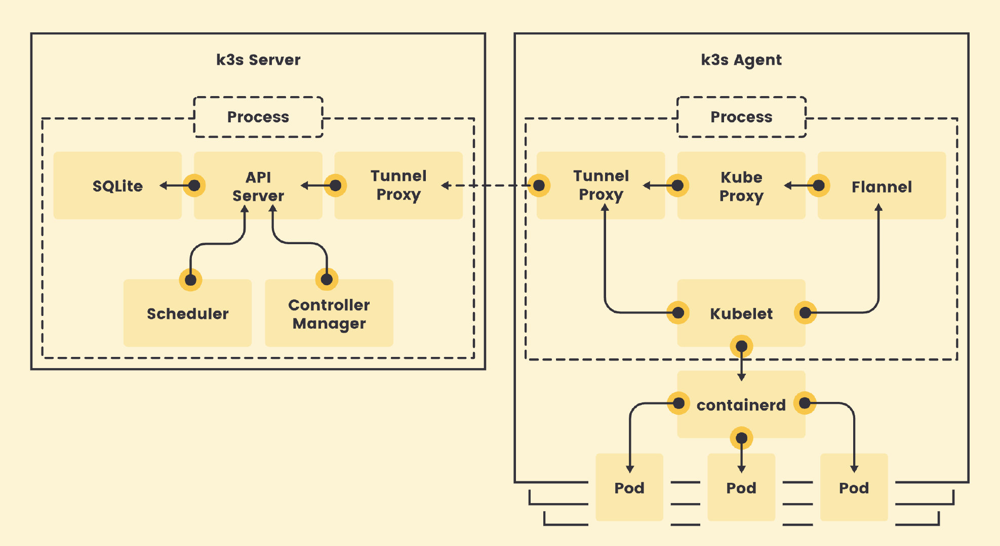
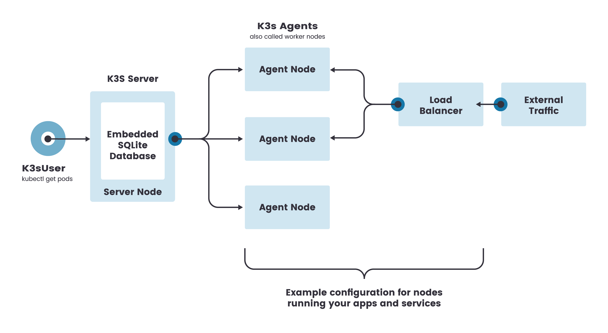
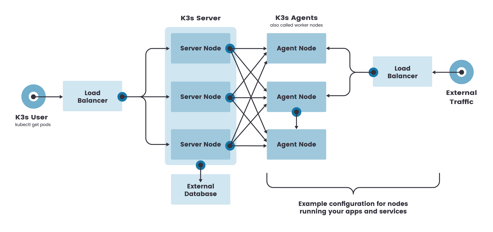

Video Reference：[02-K3s架构及快速入门](https://www.bilibili.com/video/BV14u411m7YT/?spm_id_from=333.788&vd_source=9560c118fae1db9638f05a6ba2527085)

GitHub README.md：[02-K3s架构及快速入门](https://github.com/kingsd041/k3s-tutorial/blob/main/02-K3s架构及快速入门/README.md)

## 1 架构介绍

K3s架构：

[](https://camo.githubusercontent.com/fb753e178fce8d3b13a7d8c66a39ad7e37f693a80ae589fd877a732098179c8b/68747470733a2f2f747661312e73696e61696d672e636e2f6c617267652f30303865476d5a456c7931676f3079773531766c676a33316976307530337a372e6a7067)

K8s架构： [](https://camo.githubusercontent.com/8d21ad8bc41e13122dad85ac820d54401b67b84d6a58c7793635e59d59e7bfb0/68747470733a2f2f64333377756272666b69306c36382e636c6f756466726f6e742e6e65742f323437353438396561663230313633656330663534646463316439326161386434633837633936622f65376338312f696d616765732f646f63732f636f6d706f6e656e74732d6f662d6b756265726e657465732e737667)

### 1.1 集群架构介绍

中文官网：https://docs.rancher.cn/docs/k3s/architecture/_index

### 单节点架构

K3s 架构主要分为两个角色：K3s Server 和 K3s Agent

K3s Server 主要对应的是K3s 的 Control Plane节点，主要的区别K3s使用的数据库是 SQLite。K3s Server启动之后，每个 K3s Agent把Agent 节点注册到K3s Server中。



在这种配置中，每个 agent 节点都注册到同一个 server 节点。K3s 用户可以通过调用 server 节点上的 K3s API 来操作 Kubernetes 资源。

### 高可用架构

虽然单节点 k3s 集群可以满足各种用例，但对于 Kubernetes control-plane 的正常运行至关重要的环境，您可以在高可用配置中运行 K3s。一个高可用 K3s 集群由以下几个部分组成：

- **K3s Server 节点**：两个或更多的server节点将为 Kubernetes API 提供服务并运行其他 control-plane 服务
- **外部数据库**：与单节点 k3s 设置中使用的嵌入式 SQLite 数据存储相反，高可用 K3s 需要挂载一个external database外部数据库作为数据存储的媒介。

K3s高可用架构



K3s高可用架构与K3s单节点架构主要的区别是高可用架构有一个外置的数据库，外置的数据库启动之后，在K3s Server通过配置连接到外置的数据库，当然K3s Server需要拥有多个。在前置需要有一个负载均衡器 LB。

### 1.2 固定 agent 节点的注册地址

在高可用 K3s server 配置中，每个节点还必须使用固定的注册地址向 Kubernetes API 注册，注册后，agent 节点直接与其中一个 server 节点建立连接，如下图所示：


高可用 K3s server 中的 K3s server 需要有两台以上的节点。这些节点都连接到同一个外置数据库。K3s agent 节点通过一个固定的注册地址，然后注册到对应的 K3s server 中，注册成功之后，K3s agent 节点就会选取一台 K3s server 节点建立连接，建立连接成功之后，K3s agent 就可以正常连接到 K3s server 中。K3s agent 会把所有的 K3s server API 的配置都保存到对应的 K3s agent 中。

优点是只要有一个 K3s server 是存活的，那么整个高可用 K3s 集群是没有受到影响的。

### 1.3 注册 Agent 节点

Agent 节点用`k3s agent`进程发起的 `websocket` 连接注册，连接由作为代理进程一部分运行的客户端负载均衡器维护。

Agent 将使用节点集群 secret 以及随机生成的节点密码向 k3s server 注册，密码存储在 `/etc/rancher/node/password`路径下。K3s server 将把各个节点的密码存储为 Kubernetes secrets，随后的任何尝试都必须使用相同的密码。节点密码秘密存储在`kube-system`命名空间中，名称使用模板`<host>.node-password.k3s`。

##### 注意

- 在 K3s v1.20.2 之前，K3s server 将密码存储在`/var/lib/rancher/k3s/server/cred/node-passwd`的磁盘上。
- 如果您删除了 agent 的`/etc/rancher/node`目录，则需要为该 agent 重新创建密码文件，或者从 server 中删除该条目。
- 通过使用`--with-node-id`标志启动 K3s server 或 agent，可以将唯一的节点 ID 附加到主机名中。

### 1.4 自动部署的清单

位于目录路径`/var/lib/rancher/k3s/server/manifests`的清单在构建时被捆绑到 K3s 二进制文件中，将由[rancher/helm-controller](https://github.com/rancher/helm-controller#helm-controller)在运行时安装。

## 2 快速入门

中文官网：https://docs.rancher.cn/docs/k3s/quick-start/_index

### 2.1 安装脚本

K3s 提供了一个安装脚本，可以方便的在 systemd 或 openrc 的系统上将其作为服务安装。这个脚本可以在 [https://get.k3s.io](https://get.k3s.io/) 获得。要使用这种方法安装 K3s，只需运行以下命令：

```shell
curl -sfL https://get.k3s.io | sh -
```

🔔提示

国内用户，可以使用以下方法加速安装：

```shell
curl -sfL https://rancher-mirror.rancher.cn/k3s/k3s-install.sh | INSTALL_K3S_MIRROR=cn sh -

# wget https://rancher-mirror.rancher.cn/k3s/k3s-install.sh
$ curl -sfL https://rancher-mirror.rancher.cn/k3s/k3s-install.sh | INSTALL_K3S_MIRROR=cn sh -
# 默认安装 stable 版本的K3s
[INFO]  Finding release for channel stable
# v1.25.6+k3s1 是Kubernetes的主版本+K3s的补丁版本
[INFO]  Using v1.25.6+k3s1 as release
# 下载相应的Hash文件
[INFO]  Downloading hash rancher-mirror.rancher.cn/k3s/v1.25.6-k3s1/sha256sum-amd64.txt
# 下载K3s二进制文件
[INFO]  Downloading binary rancher-mirror.rancher.cn/k3s/v1.25.6-k3s1/k3s
[INFO]  Verifying binary download
# K3s二进制文件安装路径
[INFO]  Installing k3s to /usr/local/bin/k3s
[INFO]  Skipping installation of SELinux RPM
# 创建三个软连接
[INFO]  Creating /usr/local/bin/kubectl symlink to k3s
[INFO]  Creating /usr/local/bin/crictl symlink to k3s
[INFO]  Skipping /usr/local/bin/ctr symlink to k3s, command exists in PATH at /usr/bin/ctr
# k3s-killall.sh 文件会kill掉所有的K3s进程，例如清理网络和防火墙的配置
[INFO]  Creating killall script /usr/local/bin/k3s-killall.sh 
# k3s-uninstall.sh 文件会将K3s卸载掉
[INFO]  Creating uninstall script /usr/local/bin/k3s-uninstall.sh
[INFO]  env: Creating environment file /etc/systemd/system/k3s.service.env
[INFO]  systemd: Creating service file /etc/systemd/system/k3s.service
[INFO]  systemd: Enabling k3s unit
Created symlink /etc/systemd/system/multi-user.target.wants/k3s.service → /etc/systemd/system/k3s.service.
[INFO]  systemd: Starting k3s

# 查看k3s.service服务配置文件
$ cat /etc/systemd/system/k3s.service
[Unit]
Description=Lightweight Kubernetes
Documentation=https://k3s.io
Wants=network-online.target
After=network-online.target

[Install]
WantedBy=multi-user.target

[Service]
Type=notify
EnvironmentFile=-/etc/default/%N
EnvironmentFile=-/etc/sysconfig/%N
EnvironmentFile=-/etc/systemd/system/k3s.service.env
KillMode=process
Delegate=yes
# Having non-zero Limit*s causes performance problems due to accounting overhead
# in the kernel. We recommend using cgroups to do container-local accounting.
LimitNOFILE=1048576
LimitNPROC=infinity
LimitCORE=infinity
TasksMax=infinity
TimeoutStartSec=0
Restart=always
RestartSec=5s
ExecStartPre=/bin/sh -xc '! /usr/bin/systemctl is-enabled --quiet nm-cloud-setup.service'
ExecStartPre=-/sbin/modprobe br_netfilter
ExecStartPre=-/sbin/modprobe overlay
ExecStart=/usr/local/bin/k3s \
    server \

# K3s创建的 kubeconfig 文件路径
$ cat /etc/rancher/k3s/k3s.yaml
# 如果需要使用Helm来对K3s集群进行部署资源
# 需要将 /etc/rancher/k3s/k3s.yaml 拷贝到~/.kube/config文件中(手动创建)
$ helm ls
Error: Kubernetes cluster unreachable: Get "http://localhost:8080/version": dial tcp 127.0.0.1:8080: connect: connection refused
$ mkdir -pv ~/.kube && cp /etc/rancher/k3s/k3s.yaml ~/.kube/config
$ helm ls
NAME    NAMESPACE       REVISION        UPDATED STATUS  CHART   APP VERSION
```

使用 kubectl 命令查看相应的资源

```shell
$ kubectl get nodes
NAME               STATUS   ROLES                  AGE    VERSION
ubuntu-cluster01   Ready    control-plane,master   7m1s   v1.25.6+k3s1

$ kubectl get pod --all-namespaces
NAMESPACE     NAME                                      READY   STATUS      RESTARTS   AGE
kube-system   coredns-597584b69b-jrwrg                  1/1     Running     0          7m29s
kube-system   local-path-provisioner-79f67d76f8-jw2tt   1/1     Running     0          7m29s
kube-system   metrics-server-5f9f776df5-kzf79           1/1     Running     0          7m29s
kube-system   helm-install-traefik-crd-ndvks            0/1     Completed   0          7m29s
kube-system   helm-install-traefik-jtrwt                0/1     Completed   2          7m29s
kube-system   svclb-traefik-828a7d74-8smcm              2/2     Running     0          6m12s
kube-system   traefik-66c46d954f-68dv7                  1/1     Running     0          6m12s

$ ls /var/lib/rancher/k3s/server/manifests
ccm.yaml  coredns.yaml  local-storage.yaml  metrics-server  rolebindings.yaml  traefik.yaml
```

运行此安装后：

- K3s 服务将被配置为在节点重启后或进程崩溃或被杀死时自动重启。
- 将安装其他实用程序，包括`kubectl`、`crictl`、`ctr`、`k3s-killall.sh` 和 `k3s-uninstall.sh`。
- 将[kubeconfig](https://kubernetes.io/docs/concepts/configuration/organize-cluster-access-kubeconfig/)文件写入到`/etc/rancher/k3s/k3s.yaml`，由 K3s 安装的 kubectl 将自动使用该文件

要在工作节点上安装并将它们添加到集群，请使用`K3S_URL`和`K3S_TOKEN`环境变量运行安装脚本。以下示例演示了如何加入 worker 节点：

```shell
curl -sfL https://get.k3s.io | K3S_URL=https://myserver:6443 K3S_TOKEN=mynodetoken sh -
```

🔔提示

国内用户，可以使用以下方法加速安装：

```shell
curl -sfL https://rancher-mirror.rancher.cn/k3s/k3s-install.sh | INSTALL_K3S_MIRROR=cn K3S_URL=https://myserver:6443 K3S_TOKEN=mynodetoken sh -
$ cat /var/lib/rancher/k3s/server/token
K105812a29705c640bdd97aeb7ef7029018e2913cfdceac5e82ec7e5b78fb38e150::server:e42228c2e788770eec84a9470932b304
# e42228c2e788770eec84a9470932b304

# 在K3s agent节点执行
$ curl -sfL https://rancher-mirror.rancher.cn/k3s/k3s-install.sh | INSTALL_K3S_MIRROR=cn K3S_URL=https://10.0.0.11:6443 K3S_TOKEN=e42228c2e788770eec84a9470932b304 sh -
# K3s agent创建随机的password文件
$ cat /etc/rancher/node/password
99e4ad8cddf908d40c0bc2a72899e405

# 在K3s server节点执行
$ kubectl get nodes
NAME   STATUS   ROLES                  AGE     VERSION
k3s1   Ready    control-plane,master   8m12s   v1.25.6+k3s1
k3s2   Ready    <none>                 35s     v1.25.6+k3s1
# 查看保存的密码
$ kubectl get secrets -n kube-system
NAME                                TYPE                 DATA   AGE
k3s-serving                         kubernetes.io/tls    2      12m
k3s1.node-password.k3s              Opaque               1      12m
sh.helm.release.v1.traefik-crd.v1   helm.sh/release.v1   1      11m
sh.helm.release.v1.traefik.v1       helm.sh/release.v1   1      11m
k3s2.node-password.k3s              Opaque               1      5m13s
$ kubectl get secrets -n kube-system k3s2.node-password.k3s -o yaml
apiVersion: v1
data:
  hash: JDE6NGFlYmU5MDMxOTNmZThlZToxNTo4OjE6WVZRNEtxbFVmUGZoalBUbXpIM2hMd0NGeFRZNTRHUUFzMHYzdEFFTTUvN1N3dFZwOGxZL0lXSFdlbW1tWXFQcy9GTCt0bTNmK2U2OXNXTm0yUFp5OUE=
immutable: true
kind: Secret
metadata:
  creationTimestamp: "2023-02-28T07:19:04Z"
  name: k3s2.node-password.k3s
  namespace: kube-system
  resourceVersion: "697"
  uid: f6957113-2373-4b89-860d-c3843973ea94
type: Opaque
```

示例：测试将k3s agent密码文件删除

```shell
$ rm -rf /etc/rancher/node/password
$ systemctl restart k3s-agent.service

$ tail -n 200 -f /var/log/messages 
Feb 28 15:26:57 lb02 k3s: time="2023-02-28T15:26:57+08:00" level=info msg="Waiting to retrieve agent configuration; server is not ready: Node password rejected, duplicate hostname or contents of '/etc/rancher/node/password' may not match server node-passwd entry, try enabling a unique node name with the --with-node-id flag"
Feb 28 15:27:02 lb02 k3s: time="2023-02-28T15:27:02+08:00" level=info msg="Waiting to retrieve agent configuration; server is not ready: Node password rejected, duplicate hostname or contents of '/etc/rancher/node/password' may not match server node-passwd entry, try enabling a unique node name with the --with-node-id flag"
Feb 28 15:27:07 lb02 k3s: time="2023-02-28T15:27:07+08:00" level=info msg="Waiting to retrieve agent configuration; server is not ready: Node password rejected, duplicate hostname or contents of '/etc/rancher/node/password' may not match server node-passwd entry, try enabling a unique node name with the --with-node-id flag"

# K3s server节点
$ kubectl get nodes
NAME   STATUS     ROLES                  AGE     VERSION
k3s1   Ready      control-plane,master   16m     v1.25.6+k3s1
k3s2   NotReady   <none>                 8m55s   v1.25.6+k3s1

# 解决方法：将K3s server节点的secrets对应的K3s agent的文件删除
$ kubectl delete secrets -n kube-system k3s2.node-password.k3s
$ kubectl get nodes
NAME   STATUS   ROLES                  AGE   VERSION
k3s1   Ready    control-plane,master   17m   v1.25.6+k3s1
k3s2   Ready    <none>                 10m   v1.25.6+k3s1
```

设置K3S_URL参数会使 K3s 以 worker 模式运行。K3s agent 将在所提供的 URL 上向监听的 K3s 服务器注册。K3S_TOKEN使用的值存储在你的服务器节点上的`/var/lib/rancher/k3s/server/node-token`路径下。

##### 💡注意

每台计算机必须具有唯一的主机名。如果您的计算机没有唯一的主机名，请传递`K3S_NODE_NAME`环境变量，并为每个节点提供一个有效且唯一的主机名。

### 2.2 二进制安装

GitHub Reference：https://github.com/k3s-io/k3s/releases

```shell
$ ./k3s
NAME:
   k3s - Kubernetes, but small and simple

USAGE:
   k3s [global options] command [command options] [arguments...]

VERSION:
   v1.26.1+k3s1 (f10af367)

COMMANDS:
   server           Run management server
   agent            Run node agent
   kubectl          Run kubectl
   crictl           Run crictl
   ctr              Run ctr
   check-config     Run config check
   etcd-snapshot    Trigger an immediate etcd snapshot
   secrets-encrypt  Control secrets encryption and keys rotation
   certificate      Certificates management
   completion       Install shell completion script
   help, h          Shows a list of commands or help for one command

GLOBAL OPTIONS:
   --debug                     (logging) Turn on debug logs [$K3S_DEBUG]
   --data-dir value, -d value  (data) Folder to hold state (default: /var/lib/rancher/k3s or ${HOME}/.rancher/k3s if not root)
   --help, -h                  show help
   --version, -v               print the version

# 快速启动一个K3s server节点
# 会需要占用前台进程
$ ./k3s server

# k3s 生成的文件
$ rm -rf /etc/rancher /var/lib/rancher
```

### 2.3 镜像加速

```shell
cat >> /etc/rancher/k3s/registries.yaml <<EOF
mirrors:
  "docker.io":
    endpoint:
      - "https://fogjl973.mirror.aliyuncs.com"
      - "https://registry-1.docker.io"
EOF
systemctl restart k3s
```