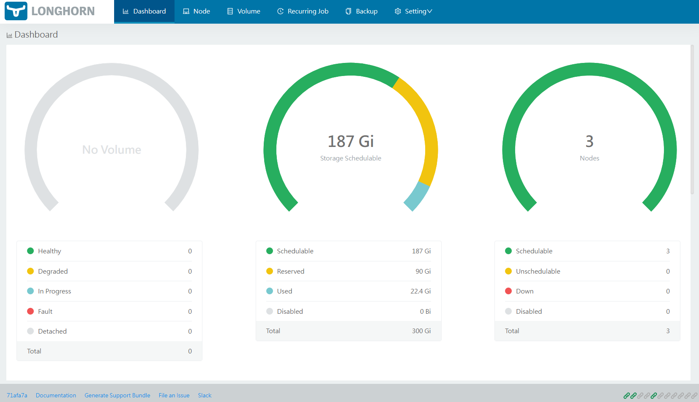
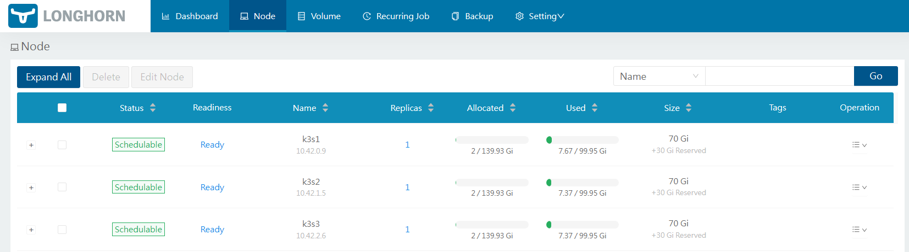
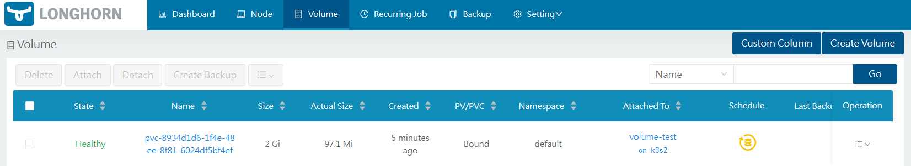
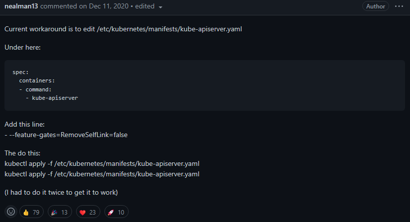
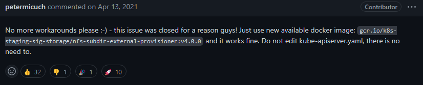

Video Reference：[14-卷和存储](https://www.bilibili.com/video/BV19r4y1v7UT/?spm_id_from=333.788&vd_source=9560c118fae1db9638f05a6ba2527085)

GitHub README.md：[14-卷和存储](https://github.com/kingsd041/k3s-tutorial/tree/main/14-卷和存储)

# 0 K3s 的存储有什么变化？

K3s 删除了几个可选的卷插件和所有内置的（有时被称为 "树内"）云提供商。我们这样做是为了实现更小的二进制文件大小，并避免对第三方云或数据中心技术和服务的依赖，这些技术和服务在许多 K3s 的使用案例中可能无法使用。我们之所以能够这样做，是因为删除这些插件既不影响 Kubernetes 的核心功能，也不影响一致性。

以下是已经从 K3s 中删除的卷插件：

- cephfs
- fc
- flocker
- git_repo
- glusterfs
- portworx
- quobyte
- rbd
- storageos

这两个组件都有树外的替代品，可以与 K3s 一起使用：Kubernetes 的[容器存储接口（CSI）](https://github.com/container-storage-interface/spec/blob/master/spec.md)和[云提供商接口（CPI）](https://kubernetes.io/docs/tasks/administer-cluster/running-cloud-controller/)。

Kubernetes 维护者正在积极将树内卷插件迁移到 CSI 驱动。有关这一迁移的更多信息，请参考[这里](https://kubernetes.io/blog/2021/12/10/storage-in-tree-to-csi-migration-status-update/)。

# 1 卷和存储

当部署一个需要保留数据的应用程序时，你需要创建持久存储。持久存储允许您从运行应用程序的 pod 外部存储应用程序数据。即使应用程序的 pod 发生故障，这种存储方式也可以使您维护应用程序数据。

本节介绍了如何通过 `local storage provider` 或 `Longhorn` 来设置持久存储。

## 1.1 💎 设置 Local Storage Provider

K3s 自带 Rancher 的 `Local Path Provisioner`，这使得能够使用各自节点上的本地存储来开箱即用地创建 pvc。

Local Path Provisioner 为 Kubernetes/K3s 用户提供了一种利用每个节点中的本地存储的方法。根据用户配置，Local Path Provisioner 将自动在节点上创建基于 `hostPath` 的持久卷。它利用了 `Kubernetes Local Persistent Volume` 特性引入的特性，但他比 Kubernetes 中内置的 local pv 特性更简单的解决方案。

范例：部署本地环境 K3s 集群

```shell
# 安装Docker容器运行时环境
# 在 K3s 节点上安装 Docker。可以使用 Rancher 的一个Docker 安装脚本来安装 Docker：
$ curl https://releases.rancher.com/install-docker/19.03.sh | sh

# 配置镜像加速器
sudo mkdir -p /etc/docker
sudo tee /etc/docker/daemon.json <<-'EOF'
{
  "registry-mirrors": ["https://po13h3y1.mirror.aliyuncs.com","http://hub-mirror.c.163.com","https://mirror.ccs.tencentyun.com","http://f1361db2.m.daocloud.io"]
}
EOF
sudo systemctl daemon-reload
sudo systemctl restart docker && sudo systemctl enable docker
# K3s Master
$ curl -sfL https://rancher-mirror.rancher.cn/k3s/k3s-install.sh | INSTALL_K3S_MIRROR=cn \
  INSTALL_K3S_VERSION="v1.21.14+k3s1" \
  INSTALL_K3S_EXEC="server --docker" \
  sh -s -
$ cat /var/lib/rancher/k3s/server/token
K1046b15950a113b87d32b8d245b15490b76722b81f16b79f0e1eb912d2fe0d6b9a::server:e8f98075887822efc50aed139e778e2d

# K3s Worker
$ curl -sfL https://rancher-mirror.rancher.cn/k3s/k3s-install.sh | INSTALL_K3S_MIRROR=cn \
  K3S_URL=https://10.0.0.51:6443 \
  K3S_TOKEN=e8f98075887822efc50aed139e778e2d INSTALL_K3S_VERSION="v1.21.14+k3s1" \
  INSTALL_K3S_EXEC="--node-ip=10.0.0.52 --docker" \
  sh -

$ curl -sfL https://rancher-mirror.rancher.cn/k3s/k3s-install.sh | INSTALL_K3S_MIRROR=cn \
  K3S_URL=https://10.0.0.51:6443 \
  K3S_TOKEN=e8f98075887822efc50aed139e778e2d INSTALL_K3S_VERSION="v1.21.14+k3s1" \
  INSTALL_K3S_EXEC="--node-ip=10.0.0.53 --docker" \
  sh -
```

范例：本地环境情况

```shell
# 本地的环境
$ kubectl get nodes -o wide
NAME   STATUS   ROLES                  AGE     VERSION         INTERNAL-IP   EXTERNAL-IP   OS-IMAGE                KERNEL-VERSION           CONTAINER-RUNTIME
k3s1   Ready    control-plane,master   5m24s   v1.21.14+k3s1   10.0.0.51     <none>        CentOS Linux 7 (Core)   3.10.0-1160.el7.x86_64   docker://19.3.15
k3s2   Ready    <none>                 2m40s   v1.21.14+k3s1   10.0.0.52     <none>        CentOS Linux 7 (Core)   3.10.0-1160.el7.x86_64   docker://19.3.15
k3s3   Ready    <none>                 39s     v1.21.14+k3s1   10.0.0.53     <none>        CentOS Linux 7 (Core)   3.10.0-1160.el7.x86_64   docker://19.3.15

# 可以查看到相应的Pod资源
$ kubectl get pods -A
NAMESPACE     NAME                                      READY   STATUS      RESTARTS   AGE
kube-system   coredns-574bcc6c46-9lgrb                  1/1     Running     0          5m21s
kube-system   helm-install-traefik-crd-wjxx7            0/1     Completed   0          5m22s
kube-system   helm-install-traefik-529q6                0/1     Completed   1          5m22s
# local-path-provisioner 默认的部署配置文件在/var/lib/rancher/k3s/server/manifests/local-storage.yaml
kube-system   local-path-provisioner-84bb864455-r8pcb   1/1     Running     0          5m21s
kube-system   metrics-server-ff9dbcb6c-b2l6s            1/1     Running     0          5m21s
kube-system   traefik-56c4b88c4b-86tw2                  1/1     Running     0          4m14s
kube-system   svclb-traefik-kwzfl                       2/2     Running     0          4m14s
kube-system   svclb-traefik-6xfr5                       2/2     Running     0          2m42s
kube-system   svclb-traefik-sqm49                       2/2     Running     0          42s

# K3s Master 查看相应资源配置文件
$ ls /var/lib/rancher/k3s/server/manifests
ccm.yaml  c_dns.yaml  local-storage.yaml  metrics-server  rolebindings.yaml  traefik.yaml
# 查看相应的StorageClass的资源文件
$ cat /var/lib/rancher/k3s/server/manifests/local-storage.yaml
$ kubectl get sc
NAME                   PROVISIONER             RECLAIMPOLICY   VOLUMEBINDINGMODE      ALLOWVOLUMEEXPANSION   AGE
local-path (default)   rancher.io/local-path   Delete          WaitForFirstConsumer   false                  9m18s
$ cat /var/lib/rancher/k3s/server/manifests/local-storage.yaml
apiVersion: v1
kind: ServiceAccount
metadata:
  name: local-path-provisioner-service-account
  namespace: kube-system
---
apiVersion: rbac.authorization.k8s.io/v1beta1
kind: ClusterRole
metadata:
  name: local-path-provisioner-role
rules:
- apiGroups: [""]
  resources: ["nodes", "persistentvolumeclaims", "configmaps"]
  verbs: ["get", "list", "watch"]
- apiGroups: [""]
  resources: ["endpoints", "persistentvolumes", "pods"]
  verbs: ["*"]
- apiGroups: [""]
  resources: ["events"]
  verbs: ["create", "patch"]
- apiGroups: ["storage.k8s.io"]
  resources: ["storageclasses"]
  verbs: ["get", "list", "watch"]
---
apiVersion: rbac.authorization.k8s.io/v1beta1
kind: ClusterRoleBinding
metadata:
  name: local-path-provisioner-bind
roleRef:
  apiGroup: rbac.authorization.k8s.io
  kind: ClusterRole
  name: local-path-provisioner-role
subjects:
- kind: ServiceAccount
  name: local-path-provisioner-service-account
  namespace: kube-system
---
# 部署Deployment的资源
apiVersion: apps/v1
kind: Deployment
metadata:
  name: local-path-provisioner
  namespace: kube-system
spec:
  replicas: 1
  selector:
    matchLabels:
      app: local-path-provisioner
  template:
    metadata:
      labels:
        app: local-path-provisioner
    spec:
      priorityClassName: "system-node-critical"
      serviceAccountName: local-path-provisioner-service-account
      tolerations:
          - key: "CriticalAddonsOnly"
            operator: "Exists"
          - key: "node-role.kubernetes.io/control-plane"
            operator: "Exists"
            effect: "NoSchedule"
          - key: "node-role.kubernetes.io/master"
            operator: "Exists"
            effect: "NoSchedule"
      containers:
      - name: local-path-provisioner
        image: rancher/local-path-provisioner:v0.0.21
        imagePullPolicy: IfNotPresent
        command:
        - local-path-provisioner
        - start
        - --config
        - /etc/config/config.json
        volumeMounts:
        - name: config-volume
          mountPath: /etc/config/
        env:
        - name: POD_NAMESPACE
          valueFrom:
            fieldRef:
              fieldPath: metadata.namespace
      volumes:
        - name: config-volume
          configMap:
            name: local-path-config
---
# 创建StorageClass的存储引擎
apiVersion: storage.k8s.io/v1
kind: StorageClass
metadata:
  name: local-path
  annotations:
    storageclass.kubernetes.io/is-default-class: "true"
provisioner: rancher.io/local-path
volumeBindingMode: WaitForFirstConsumer
reclaimPolicy: Delete
---
# 创建StorageClass的配置
kind: ConfigMap
apiVersion: v1
metadata:
  name: local-path-config
  namespace: kube-system
data:
  config.json: |-
    {
      "nodePathMap":[
      {
        "node":"DEFAULT_PATH_FOR_NON_LISTED_NODES",
        "paths":["/var/lib/rancher/k3s/storage"] # 默认存储目录，Volume数据存储的位置
        # 管理员可以自定义存储目录路径
      }
      ]
    }
  setup: |-
    #!/bin/sh
    while getopts "m:s:p:" opt
    do
        case $opt in
            p)
            absolutePath=$OPTARG
            ;;
            s)
            sizeInBytes=$OPTARG
            ;;
            m)
            volMode=$OPTARG
            ;;
        esac
    done
    mkdir -m 0777 -p ${absolutePath}
    chmod 701 ${absolutePath}/..
  teardown: |-
    #!/bin/sh
    while getopts "m:s:p:" opt
    do
        case $opt in
            p)
            absolutePath=$OPTARG
            ;;
            s)
            sizeInBytes=$OPTARG
            ;;
            m)
            volMode=$OPTARG
            ;;
        esac
    done
    rm -rf ${absolutePath}
  helperPod.yaml: |-
    apiVersion: v1
    kind: Pod
    metadata:
      name: helper-pod
    spec:
      containers:
      - name: helper-pod
        image: rancher/mirrored-library-busybox:1.34.1
```

### 1.1.1 pvc.yaml

```yaml
cat <<EOF > pvc.yaml
apiVersion: v1
kind: PersistentVolumeClaim
metadata:
  name: local-path-pvc
  namespace: default
spec:
  accessModes:
    - ReadWriteOnce
  storageClassName: local-path
  resources:
    requests:
      storage: 2Gi
EOF
```

### 1.1.2 pod.yaml

```yaml
cat <<EOF > pod.yaml
apiVersion: v1
kind: Pod
metadata:
  name: volume-test
  namespace: default
spec:
  containers:
  - name: volume-test
    image: nginx:stable-alpine
    imagePullPolicy: IfNotPresent
    volumeMounts:
    - name: volv
      mountPath: /data
    ports:
    - containerPort: 80
  volumes:
  - name: volv
    persistentVolumeClaim:
      claimName: local-path-pvc
EOF
```

### 1.1.3 应用 yaml:

```shell
$ kubectl create -f pvc.yaml
persistentvolumeclaim/local-path-pvc created

$ kubectl create -f pod.yaml
pod/volume-test created
```

### 1.1.4 确认 PV 和 PVC 已创建：

```shell
# 查看PV和PVC的状态
$ kubectl get pv,pvc
NAME                                                        CAPACITY   ACCESS MODES   RECLAIM POLICY   STATUS   CLAIM                    STORAGECLASS   REASON   AGE
persistentvolume/pvc-e33e16b1-94e4-40f1-b749-f2895cd5b0a6   2Gi        RWO            Delete           Bound    default/local-path-pvc   local-path              59s

NAME                                   STATUS   VOLUME                                     CAPACITY   ACCESS MODES   STORAGECLASS   AGE
persistentvolumeclaim/local-path-pvc   Bound    pvc-e33e16b1-94e4-40f1-b749-f2895cd5b0a6   2Gi        RWO            local-path     3m8s

# 查看Pod的运行状态
$ kubectl get pod -o wide
NAME          READY   STATUS    RESTARTS   AGE   IP          NODE   NOMINATED NODE   READINESS GATES
volume-test   1/1     Running   0          93s   10.42.1.4   k3s2   <none>           <none>

# 在Pod中编写文件，并进行查看Pod内的文件内容
$ kubectl exec -it volume-test -- sh -c "echo $(date) > /data/test.txt"
$ kubectl exec -it volume-test -- sh -c "cat /data/test.txt"
Thu Mar 23 23:58:59 CST 2023

# 可以到对应的节点(k3s2)查看文件是否存在
$ cd /var/lib/rancher/k3s/storage/
$ ls
pvc-c637caa5-fc94-4751-81c8-545141052691_default_local-path-pvc
$ cat pvc-c637caa5-fc94-4751-81c8-545141052691_default_local-path-pvc/test.txt
Fri Mar 23 23:58:59 CST 2023
```

范例：模拟 Pod 的故障

```shell
# 模拟Pod发生故障
$ kubectl delete -f pod.yaml
pod "volume-test" deleted
$ kubectl create -f pod.yaml
pod/volume-test created
# 发现数据依旧存在
$ kubectl exec -it volume-test -- sh -c "cat /data/test.txt"
Thu Mar 23 23:58:59 CST 2023
# 清理数据
$ kubectl delete -f pod.yaml -f pvc.yaml
```

## 1.2 💎 设置 Longhorn

K3s 支持 [Longhorn](https://github.com/longhorn/longhorn). Longhorn 是 Kubernetes 的一个`开源分布式块存储系统`。

下面我们介绍一个简单的例子。有关更多信息，请参阅[官方文档](https://github.com/longhorn/longhorn/blob/master/README.md)。

**Longhorn** 是一个轻量级、可靠、功能强大的 Kubernetes 分布式[块存储系统](https://cloudacademy.com/blog/object-storage-block-storage/)。

Longhorn 使用容器和微服务实现分布式块存储。Longhorn 为每个块设备卷创建一个专用的存储控制器，并在存储在多个节点上的多个副本之间同步复制该卷。存储控制器和副本本身是使用 Kubernetes 编排的。

**特征**

- 企业级分布式块存储，无单点故障
- 块存储的增量快照
- 备份到基于高效更改块检测构建的辅助存储（[NFS](https://www.extrahop.com/resources/protocols/nfs/) 或 [S3](https://aws.amazon.com/s3/) 兼容对象存储）
- 定期快照和备份
- 自动化、无中断升级。您可以升级整个 Longhorn 软件堆栈，而不会中断正在运行的存储卷。
- 直观的图形用户界面仪表板


### 1.2.1 安装 Longhorn：

```shell
# kubectl apply -f https://raw.githubusercontent.com/longhorn/longhorn/master/deploy/longhorn.yaml

# 可以下载 longhorn.yaml 配置文件
$ wget https://raw.githubusercontent.com/longhorn/longhorn/master/deploy/longhorn.yaml
$ kubectl create -f longhorn.yaml
```

Longhorn 将被安装在命名空间 `longhorn-system` 中。

```shell
# 查看longhorn-system的命名空间的所有资源
# 需要所有的Pod都启动成功，longhorn 才能启动成功
$ kubectl get all -n longhorn-system
NAME                                                      READY   STATUS    RESTARTS   AGE
pod/longhorn-recovery-backend-997bd57f-s4g7m              1/1     Running   0          12m
pod/longhorn-conversion-webhook-747fc8cbcd-bnnj6          1/1     Running   0          12m
pod/longhorn-ui-d996774-jrhq9                             1/1     Running   0          12m
pod/longhorn-recovery-backend-997bd57f-ncxlh              1/1     Running   0          12m
pod/longhorn-ui-d996774-s5dl9                             1/1     Running   0          12m
pod/longhorn-admission-webhook-54fc8fd679-sshbh           1/1     Running   0          12m
pod/longhorn-manager-cft7r                                1/1     Running   1          12m
pod/longhorn-manager-psrl8                                1/1     Running   0          12m
pod/longhorn-conversion-webhook-747fc8cbcd-bpkxq          1/1     Running   0          12m
pod/longhorn-manager-d9j8g                                1/1     Running   0          12m
pod/longhorn-driver-deployer-b89675844-j2tl9              1/1     Running   0          12m
pod/longhorn-admission-webhook-54fc8fd679-ndqg2           1/1     Running   0          12m
pod/engine-image-ei-b907910b-l7hb5                        1/1     Running   0          11m
pod/engine-image-ei-b907910b-fdswq                        1/1     Running   0          11m
pod/engine-image-ei-b907910b-hmw89                        1/1     Running   0          11m
pod/instance-manager-e-c11b800b4e57eae7de58b50ab934a0b2   1/1     Running   0          11m
pod/instance-manager-r-c11b800b4e57eae7de58b50ab934a0b2   1/1     Running   0          11m
pod/instance-manager-e-710ec2bc8a7d05f2c3e252558c8fb457   1/1     Running   0          11m
pod/instance-manager-r-710ec2bc8a7d05f2c3e252558c8fb457   1/1     Running   0          11m
pod/csi-attacher-84b96d64c8-npz8v                         1/1     Running   0          10m
pod/instance-manager-e-6b1036c0f406949531e101186b5a3e95   1/1     Running   0          11m
pod/csi-attacher-84b96d64c8-hhr8t                         1/1     Running   0          10m
pod/instance-manager-r-6b1036c0f406949531e101186b5a3e95   1/1     Running   0          11m
pod/csi-provisioner-6ccbfbf86f-flwvt                      1/1     Running   0          10m
pod/csi-resizer-58c959486d-m28n4                          1/1     Running   0          10m
pod/csi-resizer-58c959486d-zk7pq                          1/1     Running   0          10m
pod/csi-attacher-84b96d64c8-7q6dt                         1/1     Running   0          10m
pod/csi-snapshotter-7f744fbb67-jkw7k                      1/1     Running   0          10m
pod/csi-provisioner-6ccbfbf86f-qpn6x                      1/1     Running   0          10m
pod/csi-provisioner-6ccbfbf86f-6q528                      1/1     Running   0          10m
pod/longhorn-csi-plugin-2bg7h                             3/3     Running   0          10m
pod/csi-snapshotter-7f744fbb67-kpcsn                      1/1     Running   0          10m
pod/csi-resizer-58c959486d-f98ts                          1/1     Running   0          10m
pod/csi-snapshotter-7f744fbb67-xqdl9                      1/1     Running   0          10m
pod/longhorn-csi-plugin-r9jhn                             3/3     Running   0          10m
pod/longhorn-csi-plugin-xbls4                             3/3     Running   0          10m

NAME                                  TYPE        CLUSTER-IP      EXTERNAL-IP   PORT(S)        AGE
service/longhorn-backend              ClusterIP   10.43.142.188   <none>        9500/TCP       12m
service/longhorn-conversion-webhook   ClusterIP   10.43.31.156    <none>        9443/TCP       12m
service/longhorn-admission-webhook    ClusterIP   10.43.205.196   <none>        9443/TCP       12m
service/longhorn-recovery-backend     ClusterIP   10.43.91.250    <none>        9600/TCP       12m
service/longhorn-engine-manager       ClusterIP   None            <none>        <none>         12m
service/longhorn-replica-manager      ClusterIP   None            <none>        <none>         12m
service/csi-attacher                  ClusterIP   10.43.143.109   <none>        12345/TCP      10m
service/csi-provisioner               ClusterIP   10.43.12.35     <none>        12345/TCP      10m
service/csi-resizer                   ClusterIP   10.43.116.184   <none>        12345/TCP      10m
service/csi-snapshotter               ClusterIP   10.43.174.255   <none>        12345/TCP      10m
service/longhorn-frontend             ClusterIP   10.43.151.184   <none>        80/TCP         12m

NAME                                      DESIRED   CURRENT   READY   UP-TO-DATE   AVAILABLE   NODE SELECTOR   AGE
daemonset.apps/longhorn-manager           3         3         3       3            3           <none>          12m
daemonset.apps/engine-image-ei-b907910b   3         3         3       3            3           <none>          11m
daemonset.apps/longhorn-csi-plugin        3         3         3       3            3           <none>          10m

NAME                                          READY   UP-TO-DATE   AVAILABLE   AGE
deployment.apps/longhorn-recovery-backend     2/2     2            2           12m
deployment.apps/longhorn-ui                   2/2     2            2           12m
deployment.apps/longhorn-conversion-webhook   2/2     2            2           12m
deployment.apps/longhorn-driver-deployer      1/1     1            1           12m
deployment.apps/longhorn-admission-webhook    2/2     2            2           12m
deployment.apps/csi-attacher                  3/3     3            3           10m
deployment.apps/csi-provisioner               3/3     3            3           10m
deployment.apps/csi-resizer                   3/3     3            3           10m
deployment.apps/csi-snapshotter               3/3     3            3           10m

NAME                                                     DESIRED   CURRENT   READY   AGE
replicaset.apps/longhorn-recovery-backend-997bd57f       2         2         2       12m
replicaset.apps/longhorn-ui-d996774                      2         2         2       12m
replicaset.apps/longhorn-conversion-webhook-747fc8cbcd   2         2         2       12m
replicaset.apps/longhorn-driver-deployer-b89675844       1         1         1       12m
replicaset.apps/longhorn-admission-webhook-54fc8fd679    2         2         2       12m
replicaset.apps/csi-attacher-84b96d64c8                  3         3         3       10m
replicaset.apps/csi-provisioner-6ccbfbf86f               3         3         3       10m
replicaset.apps/csi-resizer-58c959486d                   3         3         3       10m
replicaset.apps/csi-snapshotter-7f744fbb67               3         3         3       10m

# 将service/longhorn-frontend修改为NodePort的方式
$ kubectl edit svc -n longhorn-system longhorn-frontend
# type: ClusterIP -> type: NodePort

# 可以直接进行修改
$ kubectl patch svc longhorn-frontend -n longhorn-system -p '{"spec":{"type": "NodePort"}}'
service/longhorn-frontend patched

# 查看Service的配置
$ kubectl get svc -n longhorn-system longhorn-frontend
NAME                TYPE       CLUSTER-IP      EXTERNAL-IP   PORT(S)        AGE
longhorn-frontend   NodePort   10.43.151.184   <none>        80:30193/TCP   13m

# 会发现创建一个longhorn的StorageClass存储类
$ kubectl get sc
NAME                   PROVISIONER             RECLAIMPOLICY   VOLUMEBINDINGMODE      ALLOWVOLUMEEXPANSION   AGE
local-path (default)   rancher.io/local-path   Delete          WaitForFirstConsumer   false                  28m
longhorn (default)     driver.longhorn.io      Delete          Immediate              true                   16m
```

通过浏览器访问`http://NodeIP:[longhorn-frontend-NodePort]`的域名，就可以 longhorn 的 WebUI。





### 1.2.2 创建 PVC 和 pod：

#### 1.2.2.1 longhorn-pvc.yaml

```yaml
cat <<EOF > longhorn-pvc.yaml
apiVersion: v1
kind: PersistentVolumeClaim
metadata:
  name: longhorn-volv-pvc
spec:
  accessModes:
    - ReadWriteOnce
  storageClassName: longhorn
  resources:
    requests:
      storage: 2Gi
EOF
```

#### 1.2.2.2 longhorn-pod.yaml

```yaml
cat <<EOF > longhorn-pod.yaml
apiVersion: v1
kind: Pod
metadata:
  name: volume-test
  namespace: default
spec:
  containers:
  - name: volume-test
    image: nginx:stable-alpine
    imagePullPolicy: IfNotPresent
    volumeMounts:
    - name: volv
      mountPath: /data
    ports:
    - containerPort: 80
  volumes:
  - name: volv
    persistentVolumeClaim:
      claimName: longhorn-volv-pvc
EOF
```

#### 1.2.2.3 确认 PV 和 PVC 已创建：

```shell
$ kubectl create -f longhorn-pvc.yaml -f longhorn-pod.yaml
persistentvolumeclaim/longhorn-volv-pvc created
pod/volume-test created

$ kubectl get pv,pvc
NAME                                                        CAPACITY   ACCESS MODES   RECLAIM POLICY   STATUS   CLAIM                       STORAGECLASS   REASON   AGE
persistentvolume/pvc-8934d1d6-1f4e-48ee-8f81-6024df5bf4ef   2Gi        RWO            Delete           Bound    default/longhorn-volv-pvc   longhorn                102s

NAME                                      STATUS   VOLUME                                     CAPACITY   ACCESS MODES   STORAGECLASS   AGE
persistentvolumeclaim/longhorn-volv-pvc   Bound    pvc-8934d1d6-1f4e-48ee-8f81-6024df5bf4ef   2Gi        RWO            longhorn       104s
```

可以通过 longhorn 的 WebUI 查看 Volume 的资源




## 1.3 💎 设置 NFS

如果你的 K3S 集群是 v1.20+，在 nfs provisioner 创建 PersistentVolumeClaim，PersistentVolumeClaim 保持 Pending 状态, 且 nfs provisioner 会报错：

```shell
I0512 03:01:54.863533       1 controller.go:926] provision "default/v1" class "nfs-provisioner": started
E0512 03:01:54.867892       1 controller.go:943] provision "default/v1" class "nfs-provisioner": unexpected error getting claim reference: selfLink was empty, can't make reference
```

### 1.3.1 原因

在 k8s 1.20 中，已根据 [release notes](https://github.com/kubernetes/kubernetes/blob/master/CHANGELOG/CHANGELOG-1.20.md) 删除 `selfLink` 参数。

正如 [github 评论](https://github.com/kubernetes-sigs/nfs-subdir-external-provisioner/issues/25#issuecomment-742616668) 中所指出的，将 `RemoveSelfLink` 设置为 `false` 可以解决这个问题。

- 修改 k3s 的配置文件



- 修改相应的镜像



### 1.3.2 解决方法

```shell
$ curl -sfL https://get.k3s.io | sh -s - --kube-apiserver-arg "feature-gates=RemoveSelfLink=false"
```

或修改`k3s.service`的服务配置文件

```shell
$ cat /etc/systemd/system/k3s.service
...
ExecStart=/usr/local/bin/k3s \
    server \
        '--kube-apiserver-arg' \
        'feature-gates=RemoveSelfLink=false' \
...
```

最后，不要忘记重启 K3s 触发更新。
