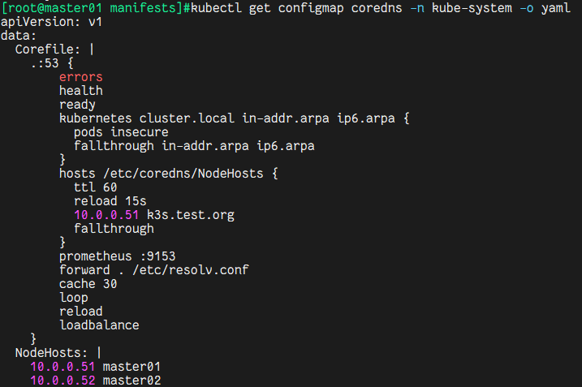

Video Reference：[15-网络](https://www.bilibili.com/video/BV1tZ4y1f7Bb/?spm_id_from=333.788&vd_source=9560c118fae1db9638f05a6ba2527085)

GitHub README.md：[15-网络](https://github.com/kingsd041/k3s-tutorial/tree/main/15-网络)

# 1 网络

本节课介绍了 CoreDNS、Traefik Ingress 控制器和 Klipper service load balancer 如何在 K3s 中工作。

关于 Flannel 配置选项和后端选择，或如何设置自己的 CNI，请参考 [安装网络选项](http://docs.rancher.cn/docs/k3s/installation/network-options/_index) 页面。

关于 K3s 需要开放哪些端口，请参考 [安装要求](http://docs.rancher.cn/docs/k3s/installation/installation-requirements/_index#网络)。

| 协议 | 端口      | 源                       | 描述                                          |
| ---- | --------- | ------------------------ | --------------------------------------------- |
| TCP  | 6443      | K3s agent 节点           | Kubernetes API Server                         |
| UDP  | 8472      | K3s server 和 agent 节点 | 仅对 Flannel VXLAN 需要                       |
| UDP  | 51820     | K3s server 和 agent 节点 | 只有 Flannel Wireguard 后端需要               |
| UDP  | 51821     | K3s server 和 agent 节点 | 只有使用 IPv6 的 Flannel Wireguard 后端才需要 |
| TCP  | 10250     | K3s server 和 agent 节点 | Kubelet metrics                               |
| TCP  | 2379-2380 | K3s server 节点          | 只有嵌入式 etcd 高可用才需要                  |

## 1.1 💎CoreDNS

CoreDNS 是在 agent 节点启动时部署的。要禁用，请在每台服务器上运行 `--disable coredns` 选项。

如果你不安装 CoreDNS，你将需要自己安装一个集群 DNS 提供商。

### 1.1.1 如何修改 coredns 参数

通过修改`/var/lib/rancher/k3s/server/manifests/coredns.yaml`配置文件会立即生效，但重启 K3s 服务会导致 coredns 配置重新初始化，所以要修改 corends 的参数，可以通过以下步骤修改：

1. 将`coredns.yaml`保存到其他目录
2. 通过 `--disable coredns` 禁用 `coredns`
3. 将备份的`coredns.yaml` 复制到 `/var/lib/rancher/k3s/server/manifests/c.yaml`，并修改对应参数

```shell
# K3s Master
$ curl -sfL https://rancher-mirror.rancher.cn/k3s/k3s-install.sh | INSTALL_K3S_MIRROR=cn \
  INSTALL_K3S_VERSION="v1.21.14+k3s1" \
  sh -
# 查看Node状态
$ kubectl get nodes
NAME       STATUS   ROLES                  AGE   VERSION
master01   Ready    control-plane,master   67s   v1.21.14+k3s
# 查看Token信息
$ cat /var/lib/rancher/k3s/server/token
K10dbbc5613e7a3ccc5fbac032657d3128d93cccaa3276102b47678b9afa40a1d5b::server:8b181d036bd00e92bec1d37f347214aa

# K3s Worker
$ curl -sfL https://rancher-mirror.rancher.cn/k3s/k3s-install.sh | INSTALL_K3S_MIRROR=cn \
  K3S_URL=https://10.0.0.51:6443 \
  K3S_TOKEN=8b181d036bd00e92bec1d37f347214aa INSTALL_K3S_VERSION="v1.21.14+k3s1" \
  INSTALL_K3S_EXEC="--node-ip=10.0.0.52" \
  sh -
# 查看Node状态
$ kubectl get nodes
NAME       STATUS   ROLES                  AGE   VERSION
master02   Ready    <none>                 55m   v1.21.14+k3s1
master01   Ready    control-plane,master   58m   v1.21.14+k3s1

# 修改coredns.yaml文件
$ cd /var/lib/rancher/k3s/server/manifests
# cp -av /var/lib/rancher/k3s/server/manifests/coredns.yaml /var/lib/rancher/k3s/server/manifests/c.yaml
$ vim coredns.yaml
[......]
Corefile: |
    .:53 {
        hosts /etc/coredns/NodeHosts {
          ttl 60
          reload 15s
          10.0.0.51 k3s.test.org
          fallthrough
        }
[......]
# 保存文件之后，就会类似于 kubectl apply -f coredns.yaml 重新引用该配置文件
# kubectl get configmap coredns -n kube-system -o yaml
```



范例：创建一个 Nginx Pod 进行测试

```shell
# 下载镜像
$ ctr images pull --all-platforms docker.io/kingsd/nginx:install-tools

$ kubectl run nginx --image=kingsd/nginx:install-tools
$ kubectl get pod -o wide
NAME    READY   STATUS    RESTARTS   AGE   IP          NODE       NOMINATED NODE   READINESS GATES
nginx   1/1     Running   0          12m   10.42.1.3   master02   <none>           <none>
$ kubectl exec -it nginx -- ping -c 1 -W 1 k3s.test.org
PING k3s.test.org (10.0.0.51) 56(84) bytes of data.
64 bytes from master01 (10.0.0.51): icmp_seq=1 ttl=63 time=2.69 ms

--- k3s.test.org ping statistics ---
1 packets transmitted, 1 received, 0% packet loss, time 0ms
rtt min/avg/max/mdev = 2.692/2.692/2.692/0.000 ms
```

当重启 k3s 集群时，会将修改后的`coredns.yaml`配置文件进行重新初始化成系统默认的配置。

```shell
$ systemctl restart k3s.service
# 重新查看之后就变成默认配置
$ cat /var/lib/rancher/k3s/server/manifests/coredns.yaml

# 为了方便后续的实验，将该coredns.yaml拷贝到/tmp下
$ cp -av /var/lib/rancher/k3s/server/manifests/coredns.yaml /tmp/cdns.yaml
```

正确的做法

```shell
# 禁用coredns的功能
$ curl -sfL https://rancher-mirror.rancher.cn/k3s/k3s-install.sh | INSTALL_K3S_MIRROR=cn \
  INSTALL_K3S_EXEC="--disable coredns" \
  INSTALL_K3S_VERSION="v1.21.14+k3s1" \
  sh -

# 会发现已经没有该coredns.yaml配置文件
$ ls -l /var/lib/rancher/k3s/server/manifests
total 16
-rw------- 1 root root 1108 Mar 23 21:26 ccm.yaml
-rw------- 1 root root 3645 Mar 23 21:26 local-storage.yaml
drwx------ 2 root root  227 Mar 23 18:29 metrics-server
-rw------- 1 root root 1039 Mar 23 21:26 rolebindings.yaml
-rw------- 1 root root 1098 Mar 23 21:26 traefik.yaml

# 可以查看Pod的运行情况
$ kubectl get pod --all-namespaces

# 编辑 cdns.yaml 文件
$ cat /tmp/cdns.yaml
apiVersion: v1
kind: ServiceAccount
metadata:
  name: coredns
  namespace: kube-system
---
apiVersion: rbac.authorization.k8s.io/v1beta1
kind: ClusterRole
metadata:
  labels:
    kubernetes.io/bootstrapping: rbac-defaults
  name: system:coredns
rules:
- apiGroups:
  - ""
  resources:
  - endpoints
  - services
  - pods
  - namespaces
  verbs:
  - list
  - watch
- apiGroups:
  - discovery.k8s.io
  resources:
  - endpointslices
  verbs:
  - list
  - watch
---
apiVersion: rbac.authorization.k8s.io/v1beta1
kind: ClusterRoleBinding
metadata:
  annotations:
    rbac.authorization.kubernetes.io/autoupdate: "true"
  labels:
    kubernetes.io/bootstrapping: rbac-defaults
  name: system:coredns
roleRef:
  apiGroup: rbac.authorization.k8s.io
  kind: ClusterRole
  name: system:coredns
subjects:
- kind: ServiceAccount
  name: coredns
  namespace: kube-system
---
apiVersion: v1
kind: ConfigMap
metadata:
  name: coredns
  namespace: kube-system
data:
  Corefile: |
    .:53 {
        errors
        health
        ready
        kubernetes cluster.local in-addr.arpa ip6.arpa {
          pods insecure
          fallthrough in-addr.arpa ip6.arpa
        }
        hosts /etc/coredns/NodeHosts {
          ttl 60
          reload 15s
          10.0.0.51 k3s.test.org
          fallthrough
        }
        prometheus :9153
        forward . /etc/resolv.conf
        cache 30
        loop
        reload
        loadbalance
    }
  NodeHosts: |
    10.0.0.51 ip-10-0-0-51
    10.0.0.52 ip-10-0-0-52
# 需要注意添加NodeHosts否则部署DNS会失败
---
apiVersion: apps/v1
kind: Deployment
metadata:
  name: coredns
  namespace: kube-system
  labels:
    k8s-app: kube-dns
    kubernetes.io/name: "CoreDNS"
spec:
  #replicas: 1
  strategy:
    type: RollingUpdate
    rollingUpdate:
      maxUnavailable: 1
  selector:
    matchLabels:
      k8s-app: kube-dns
  template:
    metadata:
      labels:
        k8s-app: kube-dns
    spec:
      priorityClassName: "system-cluster-critical"
      serviceAccountName: coredns
      tolerations:
        - key: "CriticalAddonsOnly"
          operator: "Exists"
        - key: "node-role.kubernetes.io/control-plane"
          operator: "Exists"
          effect: "NoSchedule"
        - key: "node-role.kubernetes.io/master"
          operator: "Exists"
          effect: "NoSchedule"
      nodeSelector:
        beta.kubernetes.io/os: linux
      containers:
      - name: coredns
        image: rancher/mirrored-coredns-coredns:1.9.1
        imagePullPolicy: IfNotPresent
        resources:
          limits:
            memory: 170Mi
          requests:
            cpu: 100m
            memory: 70Mi
        args: [ "-conf", "/etc/coredns/Corefile" ]
        volumeMounts:
        - name: config-volume
          mountPath: /etc/coredns
          readOnly: true
        ports:
        - containerPort: 53
          name: dns
          protocol: UDP
        - containerPort: 53
          name: dns-tcp
          protocol: TCP
        - containerPort: 9153
          name: metrics
          protocol: TCP
        securityContext:
          allowPrivilegeEscalation: false
          capabilities:
            add:
            - NET_BIND_SERVICE
            drop:
            - all
          readOnlyRootFilesystem: true
        livenessProbe:
          httpGet:
            path: /health
            port: 8080
            scheme: HTTP
          initialDelaySeconds: 60
          periodSeconds: 10
          timeoutSeconds: 1
          successThreshold: 1
          failureThreshold: 3
        readinessProbe:
          httpGet:
            path: /ready
            port: 8181
            scheme: HTTP
          initialDelaySeconds: 0
          periodSeconds: 2
          timeoutSeconds: 1
          successThreshold: 1
          failureThreshold: 3
      dnsPolicy: Default
      volumes:
        - name: config-volume
          configMap:
            name: coredns
            items:
            - key: Corefile
              path: Corefile
            - key: NodeHosts
              path: NodeHosts
---
apiVersion: v1
kind: Service
metadata:
  name: kube-dns
  namespace: kube-system
  annotations:
    prometheus.io/port: "9153"
    prometheus.io/scrape: "true"
  labels:
    k8s-app: kube-dns
    kubernetes.io/cluster-service: "true"
    kubernetes.io/name: "CoreDNS"
spec:
  selector:
    k8s-app: kube-dns
  clusterIP: 10.43.0.10
  ports:
  - name: dns
    port: 53
    protocol: UDP
  - name: dns-tcp
    port: 53
    protocol: TCP
  - name: metrics
    port: 9153
    protocol: TCP
# 注意不能将c_dns.yaml修改为coredns.yaml文件，否则K3s会认为是系统初始化的默认配置文件
# 由于是"--disable coredns"，所以若命名为coredns.yaml，K3s重启服务后会删除该文件
$ cp -av /tmp/cdns.yaml /var/lib/rancher/k3s/server/manifests/
$ ls -l /var/lib/rancher/k3s/server/manifests/
total 24
-rw------- 1 root root 1108 Mar 23 21:26 ccm.yaml
-rw------- 1 root root 4483 Mar 23 21:31 cdns.yaml
-rw------- 1 root root 3645 Mar 23 21:26 local-storage.yaml
drwx------ 2 root root  227 Mar 23 18:29 metrics-server
-rw------- 1 root root 1039 Mar 23 21:26 rolebindings.yaml
-rw------- 1 root root 1098 Mar 23 21:26 traefik.yaml

# 查看是否已经创建好coredns的Pod
$ kubectl get pod --all-namespaces

# 进行测试
$ kubectl run nginx --image=kingsd/nginx:install-tools
$ kubectl get pod -o wide
NAME    READY   STATUS    RESTARTS   AGE   IP           NODE       NOMINATED NODE   READINESS GATES
nginx   1/1     Running   0          6s    10.42.1.11   master02   <none>           <none>
$ kubectl exec -it nginx -- ping -c 1 -W 1 k3s.test.org
PING k3s.test.org (10.0.0.51) 56(84) bytes of data.
64 bytes from ip-10-0-0-51 (10.0.0.51): icmp_seq=1 ttl=63 time=1.14 ms

--- k3s.test.org ping statistics ---
1 packets transmitted, 1 received, 0% packet loss, time 0ms
rtt min/avg/max/mdev = 1.147/1.147/1.147/0.000 m

# 重启K3s集群服务，查看配置是否会初始化配置
$ systemctl restart k3s.service
# 会发现并不会对coredns的配置做修改
$ cat /var/lib/rancher/k3s/server/manifests/cdns.yaml
```

## 1.2 💎Traefik Ingress Controller

启动 server 时，默认情况下会部署 Traefik。默认的配置文件在`/var/lib/rancher/k3s/server/manifests/traefik.yaml`中，对该文件的任何修改都会以类似`kubectl apply`的方式自动部署到 Kubernetes 中。

Traefik ingress controller 将使用主机上的 `80` 和 `443` 端口（即这些端口不能用于 HostPort 或 NodePort）。

Traefik 可以通过编辑`traefik.yaml`文件进行配置。为了防止 k3s 使用或覆盖修改后的版本，请使用`--disable traefik`部署 k3s，并将修改后的副本存储在`k3s/server/manifests`目录中。更多信息请参考官方的 [Traefik 配置参数](https://github.com/helm/charts/tree/master/stable/traefik#configuration)。

要禁用它，请使用`--disable traefik`选项启动每个 server。

```shell
# 会发现并不会有进程监听80和443端口
$ netstat -auntlp | grep -E "80|443"
# 主要是因为Traefik没有把80和443监听到主机上面，但是并不会影响其功能
# Traefik主要是通过iptables的方式进行转发

# 查看iptables规则
$ iptables -nL -t nat | grep "\<443\>"
CNI-HOSTPORT-SETMARK  tcp  --  10.42.0.0/24         0.0.0.0/0            tcp dpt:443
CNI-HOSTPORT-SETMARK  tcp  --  127.0.0.1            0.0.0.0/0            tcp dpt:443
DNAT       tcp  --  0.0.0.0/0            0.0.0.0/0            tcp dpt:443 to:10.42.0.7:443
CNI-DN-db7ad52b865fb5d94c977  tcp  --  0.0.0.0/0            0.0.0.0/0            /* dnat name: "cbr0" id: "deb7a2b32ae653e362388b98e974787ecb01bea252713f39606707b4980bb850" */ multiport dports 80,443
KUBE-MARK-MASQ  tcp  -- !10.42.0.0/16         10.43.0.1            /* default/kubernetes:https cluster IP */ tcp dpt:443
KUBE-SVC-NPX46M4PTMTKRN6Y  tcp  --  0.0.0.0/0            10.43.0.1            /* default/kubernetes:https cluster IP */ tcp dpt:443
KUBE-MARK-MASQ  tcp  -- !10.42.0.0/16         10.43.205.86         /* kube-system/metrics-server:https cluster IP */ tcp dpt:443
KUBE-SVC-Z4ANX4WAEWEBLCTM  tcp  --  0.0.0.0/0            10.43.205.86         /* kube-system/metrics-server:https cluster IP */ tcp dpt:443
KUBE-MARK-MASQ  tcp  -- !10.42.0.0/16         10.43.154.214        /* kube-system/traefik:websecure cluster IP */ tcp dpt:443
KUBE-SVC-CVG3OEGEH7H5P3HQ  tcp  --  0.0.0.0/0            10.43.154.214        /* kube-system/traefik:websecure cluster IP */ tcp dpt:443
KUBE-FW-CVG3OEGEH7H5P3HQ  tcp  --  0.0.0.0/0            10.0.0.51            /* kube-system/traefik:websecure loadbalancer IP */ tcp dpt:443
KUBE-FW-CVG3OEGEH7H5P3HQ  tcp  --  0.0.0.0/0            10.0.0.52            /* kube-system/traefik:websecure loadbalancer IP */ tcp dpt:44

$ kubectl get pod -o wide -A | grep "10.42.0.7"
kube-system   svclb-traefik-v792h                       2/2     Running     0          3h13m   10.42.0.7    master01   <none>           <none>

$ kubectl exec -it -n kube-system svclb-traefik-v792h -- /bin/sh
Defaulted container "lb-port-80" out of: lb-port-80, lb-port-443
/ # iptables -L -t nat | grep 443
DNAT       tcp  -- !traefik.kube-system.svc.cluster.local  anywhere             tcp dpt:https to:10.43.154.214:443
# 将Pod的流量都转发到了10.43.154.214:443地址中

# 可以查看到该10.43.154.214是一个Service的地址
$ kubectl get svc -A | grep 10.43.154.214
kube-system   traefik          LoadBalancer   10.43.154.214   10.0.0.51,10.0.0.52   80:32263/TCP,443:30906/TCP   3h14m
# 总结：Traefik通过这一系列的转发，由Traefik来处理下一跳的流量
```

### 1.2.1 如何启用 Treafik2 dashboard：

```yaml
# Note: in a kubernetes secret the string (e.g. generated by htpasswd) must be base64-encoded first.
# To create an encoded user:password pair, the following command can be used:
# htpasswd -nb admin      admin      | openssl base64
# htpasswd -nb [username] [password] | openssl base64

apiVersion: v1
kind: Secret
metadata:
  name: authsecret
  namespace: default
data:
  users: |2
    YWRtaW46JGFwcjEkLkUweHd1Z0EkUjBmLi85WndJNXZWRFMyR2F2LmtELwoK
---
apiVersion: traefik.containo.us/v1alpha1
kind: IngressRoute
metadata:
  name: traefik-dashboard
spec:
  routes:
  - match: Host(`traefik.example.com`) && (PathPrefix(`/api`) || PathPrefix(`/dashboard`))
    kind: Rule
    services:
    - name: api@internal
      kind: TraefikService
    middlewares:
      - name: auth
---
apiVersion: traefik.containo.us/v1alpha1
kind: Middleware
metadata:
  name: auth
spec:
  basicAuth:
    secret: authsecret # Kubernetes secret named "secretName"
$ kubectl create -f treafik2_dashboard.yaml
secret/authsecret created
ingressroute.traefik.containo.us/traefik-dashboard created
middleware.traefik.containo.us/auth created

# 查看本机的/etc/hosts文件
# 添加相应的条目
10.0.0.51 traefik.example.com
```

然后通过 http://traefik.example.com/dashboard/ 访问 traefik dashboard

参考：

https://doc.traefik.io/traefik/operations/dashboard/

https://doc.traefik.io/traefik/middlewares/basicauth/#general

## 1.3 💎Service Load Balancer

K3s 提供了一个名为[Klipper Load Balancer](https://github.com/rancher/klipper-lb)的负载均衡器，它可以使用可用的主机端口。 允许创建 LoadBalancer 类型的 Service，但不包括 LB 的实现。某些 LB 服务需要云提供商，例如 Amazon EC2 或 Microsoft Azure。相比之下，K3s service LB 使得可以在没有云提供商的情况下使用 LB 服务。

### 1.3.1 Service LB 如何工作

K3s 创建了一个控制器，该控制器为 service load balancer 创建了一个 Pod，这个 Pod 是[Service](https://kubernetes.io/docs/concepts/services-networking/service/)类型的 Kubernetes 对象。

对于每个 `service load balancer`，都会创建一个[DaemonSet](https://kubernetes.io/docs/concepts/workloads/controllers/daemonset/)。 DaemonSet 在每个节点上创建一个前缀为svc的 Pod。

Service LB 控制器会监听其他 Kubernetes Services。当它找到一个 Service 后，它会在所有节点上使用 DaemonSet 为该服务创建一个代理 Pod。这个 Pod 成为其他 Service 的代理，例如，来自节点上 8000 端口的请求可以被路由到端口 8888 上的工作负载。

如果 Service LB 运行在有外部 IP 的节点上，则使用外部 IP。

如果创建多个 Services，则为每个 Service 创建一个单独的 DaemonSet。

只要使用不同的端口，就可以在同一节点上运行多个 Services。

如果您尝试创建一个在 80 端口上监听的 Service LB，Service LB 将尝试在集群中找到 80 端口的空闲主机。如果该端口没有可用的主机，LB 将保持 Pending 状态。

### 1.3.2 用法

在 K3s 中创建一个 [LoadBalancer 类型的 Service](https://kubernetes.io/docs/concepts/services-networking/service/#loadbalancer)。

```yaml
---
apiVersion: apps/v1
kind: Deployment
metadata:
  name:  nginx-deployment
  namespace: default
  labels:
    app: nginx
spec:
  selector:
    matchLabels:
      app: nginx
  replicas: 1
  template:
    metadata:
      labels:
        app: nginx
    spec:
      containers:
      - name:  nginx
        image: kingsd/nginx:install-tools
        ports:
        - containerPort: 80
          name: nginx-port
---
apiVersion: v1
kind: Service
metadata:
  name: nginx
  namespace: default
spec:
  selector:
    app: nginx
  type: LoadBalancer
  ports:
  - name: nginx
    protocol: TCP
    port: 8888
    targetPort: nginx-port
$ kubectl create -f nginx-loadbalancer.yaml
deployment.apps/nginx-deployment created
service/nginx created

# svclb是分别部署到两个节点中
$ kubectl get pod -o wide
NAME                                READY   STATUS    RESTARTS   AGE    IP           NODE       NOMINATED NODE   READINESS GATES
svclb-nginx-sjwcn                   1/1     Running   0          100s   10.42.1.12   master02   <none>           <none>
svclb-nginx-q5jmr                   1/1     Running   0          100s   10.42.0.9    master01   <none>           <none>
nginx-deployment-6b769f4497-hvvlx   1/1     Running   0          100s   10.42.0.8    master01   <none>           <none>
$ kubectl get svc nginx
NAME    TYPE           CLUSTER-IP     EXTERNAL-IP           PORT(S)          AGE
nginx   LoadBalancer   10.43.92.152   10.0.0.51,10.0.0.52   8888:30285/TCP   40s

$ curl 10.0.0.51:8888 # curl 10.0.0.52:8888 效果是一样的
<!DOCTYPE html>
<html>
<head>
<title>Welcome to nginx!</title>
<style>
    body {
        width: 35em;
        margin: 0 auto;
        font-family: Tahoma, Verdana, Arial, sans-serif;
    }
</style>
</head>
<body>
<h1>Welcome to nginx!</h1>
<p>If you see this page, the nginx web server is successfully installed and
working. Further configuration is required.</p>

<p>For online documentation and support please refer to
<a href="http://nginx.org/">nginx.org</a>.<br/>
Commercial support is available at
<a href="http://nginx.com/">nginx.com</a>.</p>

<p><em>Thank you for using nginx.</em></p>
</body>
</html>
<!DOCTYPE html>
<html>
<head>
<title>Welcome to nginx!</title>
<style>
    body {
        width: 35em;
        margin: 0 auto;
        font-family: Tahoma, Verdana, Arial, sans-serif;
    }
</style>
</head>
<body>
<h1>Welcome to nginx!</h1>
<p>If you see this page, the nginx web server is successfully installed and
working. Further configuration is required.</p>

<p>For online documentation and support please refer to
<a href="http://nginx.org/">nginx.org</a>.<br/>
Commercial support is available at
<a href="http://nginx.com/">nginx.com</a>.</p>

<p><em>Thank you for using nginx.</em></p>
</body>
</html>
# 查看相应的防火墙流量转发策略
$ iptables -vnL -t nat | grep "8888"
    0     0 CNI-HOSTPORT-SETMARK  tcp  --  *      *       10.42.0.0/24         0.0.0.0/0            tcp dpt:8888
    0     0 CNI-HOSTPORT-SETMARK  tcp  --  *      *       127.0.0.1            0.0.0.0/0            tcp dpt:8888
    0     0 DNAT       tcp  --  *      *       0.0.0.0/0            0.0.0.0/0            tcp dpt:8888 to:10.42.0.9:8888
    0     0 CNI-DN-68413b838d71095be3d08  tcp  --  *      *       0.0.0.0/0            0.0.0.0/0            /* dnat name: "cbr0" id: "1910e402d8848a47de520b76168aee611b54a64f314dd3a42c6d39ea7ad92d93" */ multiport dports 8888
    0     0 KUBE-MARK-MASQ  tcp  --  *      *      !10.42.0.0/16         10.43.92.152         /* default/nginx:nginx cluster IP */ tcp dpt:8888
    0     0 KUBE-SVC-GFECHBCWDTHJWART  tcp  --  *      *       0.0.0.0/0            10.43.92.152         /* default/nginx:nginx cluster IP */ tcp dpt:8888
    1    60 KUBE-FW-GFECHBCWDTHJWART  tcp  --  *      *       0.0.0.0/0            10.0.0.51            /* default/nginx:nginx loadbalancer IP */ tcp dpt:8888
    0     0 KUBE-FW-GFECHBCWDTHJWART  tcp  --  *      *       0.0.0.0/0            10.0.0.52            /* default/nginx:nginx loadbalancer IP */ tcp dpt:8888

$ kubectl get pod -o wide -A | grep 10.42.0.9
default       svclb-nginx-q5jmr                         1/1     Running     0          3m58s   10.42.0.9    master01   <none>           <none>

$ kubectl exec -it svclb-nginx-q5jmr -- /bin/sh
/ # iptables -L -t nat | grep "8888"
DNAT       tcp  -- !nginx.default.svc.cluster.local  anywhere             tcp dpt:8888 to:10.43.92.152:8888

$ kubectl get svc | grep "10.43.92.152"
nginx        LoadBalancer   10.43.92.152   10.0.0.51,10.0.0.52   8888:30285/TCP   4m50s

# 查看Service的详细信息显示
$ kubectl describe svc nginx
Name:                     nginx
Namespace:                default
Labels:                   <none>
Annotations:              <none>
Selector:                 app=nginx
Type:                     LoadBalancer
IP Family Policy:         SingleStack
IP Families:              IPv4
IP:                       10.43.92.152
IPs:                      10.43.92.152
LoadBalancer Ingress:     10.0.0.51, 10.0.0.52
Port:                     nginx  8888/TCP
TargetPort:               nginx-port/TCP
NodePort:                 nginx  30285/TCP
Endpoints:                10.42.0.8:80
Session Affinity:         None
External Traffic Policy:  Cluster
Events:                   <none>
# 查看 Endpoints 信息
$ kubectl get endpoints nginx
NAME    ENDPOINTS      AGE
nginx   10.42.0.8:80   5m57s

$ kubectl get pod -o wide | grep "10.42.0.8"
nginx-deployment-6b769f4497-hvvlx   1/1     Running   0          6m41s   10.42.0.8    master01   <none>           <none>
```

### 1.3.3 🎓从节点中排除 Service LB

要排除节点使用 Service LB，请将以下标签添加到不应排除的节点上：

```shell
svccontroller.k3s.cattle.io/enablelb 
```

如果使用标签，则 `service load balancer` 仅在标记的节点上运行。

```shell
# 查看Node的标签
$ kubectl get nodes --show-labels
NAME       STATUS   ROLES                  AGE     VERSION         LABELS
master02   Ready    <none>                 3h46m   v1.21.14+k3s1   beta.kubernetes.io/arch=amd64,beta.kubernetes.io/instance-type=k3s,beta.kubernetes.io/os=linux,kubernetes.io/arch=amd64,kubernetes.io/hostname=master02,kubernetes.io/os=linux,node.kubernetes.io/instance-type=k3s
master01   Ready    control-plane,master   3h49m   v1.21.14+k3s1   beta.kubernetes.io/arch=amd64,beta.kubernetes.io/instance-type=k3s,beta.kubernetes.io/os=linux,kubernetes.io/arch=amd64,kubernetes.io/hostname=master01,kubernetes.io/os=linux,node-role.kubernetes.io/control-plane=true,node-role.kubernetes.io/master=true,node.kubernetes.io/instance-type=k3s

$ kubectl label node master02 svccontroller.k3s.cattle.io/enablelb=true
node/master02 labeled
# 再次查看Node的标签
$ kubectl get nodes --show-labels
NAME       STATUS   ROLES                  AGE     VERSION         LABELS
master01   Ready    control-plane,master   3h49m   v1.21.14+k3s1   beta.kubernetes.io/arch=amd64,beta.kubernetes.io/instance-type=k3s,beta.kubernetes.io/os=linux,kubernetes.io/arch=amd64,kubernetes.io/hostname=master01,kubernetes.io/os=linux,node-role.kubernetes.io/control-plane=true,node-role.kubernetes.io/master=true,node.kubernetes.io/instance-type=k3s
master02   Ready    <none>                 3h47m   v1.21.14+k3s1   beta.kubernetes.io/arch=amd64,beta.kubernetes.io/instance-type=k3s,beta.kubernetes.io/os=linux,kubernetes.io/arch=amd64,kubernetes.io/hostname=master02,kubernetes.io/os=linux,node.kubernetes.io/instance-type=k3s,svccontroller.k3s.cattle.io/enablelb=tru

# 会发现已经没有master02的svclb的Pod
$ kubectl get pods -o wide
NAME                                READY   STATUS    RESTARTS   AGE     IP           NODE       NOMINATED NODE   READINESS GATES
nginx-deployment-6b769f4497-hvvlx   1/1     Running   0          9m45s   10.42.0.8    master01   <none>           <none>
svclb-nginx-22vfc                   1/1     Running   0          23s     10.42.1.14   master02   <none>           <none>
```

### 1.3.4 🎓禁用 Service LB

要禁用嵌入式 LB，请使用`--disable servicelb`选项运行 k3s server。

如果您希望运行其他 LB，例如 MetalLB [ 四层负载均衡器 ] ，这是必需的。

## 1.4 没有主机名的节点

一些云提供商（如 Linode）会以 "`localhost` "作为主机名创建机器，而其他提供商可能根本没有设置主机名。这可能会导致域名解析的问题。你可以用`--node-name`标志或`K3S_NODE_NAME`环境变量来运行 K3s，这样就会传递节点名称来解决这个问题。

- `指定主机名`：

```bash
# K3S_URL : 指定K3s Master URL
# K3S_TOKEN : 指定K3s Master Token[cat /var/lib/rancher/k3s/server/token]
curl -sfL https://rancher-mirror.rancher.cn/k3s/k3s-install.sh | INSTALL_K3S_MIRROR=cn \
  K3S_URL=https://10.0.0.30:6443 \ 
  K3S_TOKEN=6f4f3e77082caf01f1e4874bbbab61a6 sh -s - --node-name k3s2
# K3S_URL : 指定K3s Master URL
# K3S_TOKEN : 指定K3s Master Token[cat /var/lib/rancher/k3s/server/token]
# 使用环境变量的方式指定主机名最后还是会以参数的形式进行修改
curl -sfL https://rancher-mirror.cnrancher.com/k3s/k3s-install.sh | K3S_NODE_NAME="k3s2" \
  INSTALL_K3S_MIRROR=cn \
  K3S_URL=https://10.0.0.30:6443 \
  K3S_TOKEN=6f4f3e77082caf01f1e4874bbbab61a6 sh -
$ kubectl get nodes
NAME   STATUS   ROLES                  AGE   VERSION
k3s1   Ready    control-plane,master   72m   v1.25.6+k3s1
k3s2   Ready    <none>                 28s   v1.25.6+k3s1
```