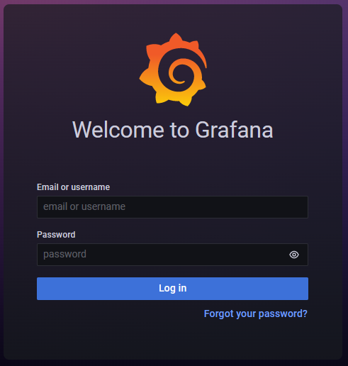

Video Reference：[16-Helm](https://www.bilibili.com/video/BV1wS4y1773w/?spm_id_from=333.788&vd_source=9560c118fae1db9638f05a6ba2527085)

GitHub README.md：[16-Helm](https://github.com/kingsd041/k3s-tutorial/tree/main/16-Helm)

# 1 Helm

Helm 是 Kubernetes 的包管理工具。Helm Chart 为 Kubernetes YAML 清单文件提供了模板化语法，可以通过 Helm 安装对应的chart。更多请参考：[Helm 快速入门](https://helm.sh/docs/intro/quickstart/)

K3s 不需要任何特殊的配置就可以使用 Helm 命令行工具。只要确保你已经按照[集群访问](http://docs.rancher.cn/docs/k3s/cluster-access/_index/)一节正确设置了你的 kubeconfig。 K3s 通过 `rancher/helm-release CRD` 使传统的 Kubernetes 资源清单和 Helm Charts 部署更加容易。

```shell
$ curl -sfL https://rancher-mirror.rancher.cn/k3s/k3s-install.sh | INSTALL_K3S_MIRROR=cn \
  INSTALL_K3S_EXEC="--docker" INSTALL_K3S_VERSION="v1.21.14+k3s1" \
  sh -

$ kubectl get nodes
NAME           STATUS   ROLES                  AGE   VERSION
k3s-server-2   Ready    control-plane,master   55s   v1.25.6+k3s1
$ helm ls
Error: Kubernetes cluster unreachable: Get "https://127.0.0.1:6443/version": x509: certificate signed by unknown authority
# 需要将手动创建~/.kube/config文件
$ mkdir -pv ~/.kube && cp /etc/rancher/k3s/k3s.yaml ~/.kube/config
$ helm ls
NAME    NAMESPACE       REVISION        UPDATED STATUS  CHART   APP VERSION
```

## 1.1 自动部署 Helm charts

在`/var/lib/rancher/k3s/server/manifests`中找到的任何 Kubernetes 清单将以类似`kubectl apply`的方式自动部署到 K3s。以这种方式部署的 manifests 是作为 AddOn 自定义资源来管理的，可以通过运行`kubectl get addon -A`来查看。你会发现打包组件的 `AddOns`，如 CoreDNS、Local-Storage、Traefik 等。AddOns 是由部署控制器自动创建的，并根据它们在 manifests 目录下的文件名命名。

也可以将 Helm Chart 作为 AddOns 部署。K3s 包括一个[Helm Controller](https://github.com/rancher/helm-controller/)，它使用 `HelmChart Custom Resource Definition(CRD)`管理 Helm Chart。

```shell
# K3s会监听该目录下的资源
$ ls /var/lib/rancher/k3s/server/manifests/
ccm.yaml  coredns.yaml  local-storage.yaml  metrics-server  rolebindings.yaml  traefik.yaml
# Yaml文件中使用的资源对象均是Kubernetes常见的资源对象

$ cat /var/lib/rancher/k3s/server/manifests/traefik.yaml
apiVersion: helm.cattle.io/v1
kind: HelmChart
metadata:
  name: traefik-crd
  namespace: kube-system
spec:
  # KUBERNETES_API 就是6443的URL
  chart: https://%{KUBERNETES_API}%/static/charts/traefik-crd-10.14.100.tgz
---
apiVersion: helm.cattle.io/v1
kind: HelmChart
metadata:
  name: traefik
  namespace: kube-system
spec:
  chart: https://%{KUBERNETES_API}%/static/charts/traefik-10.14.100.tgz
  # set 和 valuesContent 用来修改Chart的默认值
  # set 修改Chart的默认值的优先级要高
  set:
    global.systemDefaultRegistry: ""
  valuesContent: |-
    rbac:
      enabled: true
    ports:
      websecure:
        tls:
          enabled: true
    podAnnotations:
      prometheus.io/port: "8082"
      prometheus.io/scrape: "true"
    providers:
      kubernetesIngress:
        publishedService:
          enabled: true
    priorityClassName: "system-cluster-critical"
    image:
      name: "rancher/mirrored-library-traefik"
      tag: "2.6.1"
    tolerations:
    - key: "CriticalAddonsOnly"
      operator: "Exists"
    - key: "node-role.kubernetes.io/control-plane"
      operator: "Exists"
      effect: "NoSchedule"
    - key: "node-role.kubernetes.io/master"
      operator: "Exists"
      effect: "NoSchedule"

# 查看Charts的源文件(适用于离线环境)
$ ls /var/lib/rancher/k3s/server/static/charts/
traefik-10.14.100.tgz  traefik-crd-10.14.100.tgz

# 查看Charts创建的资源
$ kubectl get pod -A
NAMESPACE     NAME                                      READY   STATUS      RESTARTS   AGE
kube-system   local-path-provisioner-79f67d76f8-n8snv   1/1     Running     0          11m
kube-system   coredns-597584b69b-vt7nb                  1/1     Running     0          11m
kube-system   helm-install-traefik-crd-t7www            0/1     Completed   0          11m
kube-system   svclb-traefik-c8eadbe4-xb2gv              2/2     Running     0          10m
kube-system   traefik-66c46d954f-b7zwv                  1/1     Running     0          10m
kube-system   helm-install-traefik-lrgcg                0/1     Completed   1          11m
kube-system   metrics-server-5f9f776df5-dxvvj           1/1     Running     0          11m
```

总结：就是可以自定义一个Yaml文件，资源类型是`HelmChart`，放到`/var/lib/rancher/k3s/server/manifests/`中，当启动K3s集群的时候，会自动将Yaml配置的`HelmChart`里面的`Charts`部署到K3s集群中。

## 1.2 使用 Helm CRD

[HelmChart CRD](https://github.com/rancher/helm-controller#helm-controller)捕获了大多数你通常会传递给`helm`命令行工具的选项。下面是一个例子，说明如何从默认的 Chart 资源库中部署 Grafana，覆盖一些默认的 Chart 值。请注意，HelmChart 资源本身在 `kube-system` 命名空间，但 Chart 资源将被部署到 `monitoring` 命名空间。

GtiHub Reference：https://github.com/grafana/helm-charts

```yaml
apiVersion: helm.cattle.io/v1
kind: HelmChart
metadata:
  name: grafana
  # HelmChart 部署到的命名空间
  namespace: kube-system
spec:
  chart: stable/grafana
  # chart 部署到命名空间
  targetNamespace: monitoring
  set:
    adminPassword: "NotVerySafePassword"
  valuesContent: |-
    image:
      tag: master
    env:
      GF_EXPLORE_ENABLED: true
    adminUser: admin
    sidecar:
      datasources:
        enabled: true
$ kubectl create namespace monitoring

$ kubectl create -f grafana-helmchart.yaml
helmchart.helm.cattle.io/grafana created
$ kubectl get job -n kube-system
NAME                       COMPLETIONS   DURATION   AGE
helm-install-traefik-crd   1/1           6m28s      79m
helm-install-traefik       1/1           6m31s      79m
helm-install-grafana       1/1           4m43s      75m

# 查看部署的资源信息
$ kubectl get all -n monitoring
NAME                          READY   STATUS    RESTARTS   AGE
pod/grafana-64df5d6c5-lkgn6   1/1     Running   0          25m

NAME              TYPE        CLUSTER-IP     EXTERNAL-IP   PORT(S)   AGE
service/grafana   ClusterIP   10.43.92.235   <none>        80/TCP    25m

NAME                      READY   UP-TO-DATE   AVAILABLE   AGE
deployment.apps/grafana   1/1     1            1           25m

NAME                                DESIRED   CURRENT   READY   AGE
replicaset.apps/grafana-64df5d6c5   1         1         1       25m
```

### 1.2.1 HelmChart 字段定义

| 字段                   | 默认值  | 描述                                                         | Helm Argument / Flag Equivalent |
| ---------------------- | ------- | ------------------------------------------------------------ | ------------------------------- |
| `name`                 | N/A     | Helm Chart 名称                                              | NAME                            |
| `spec.chart`           | N/A     | 仓库中的 Helm Chart 名称，或完整的 HTTPS URL（.tgz）。       | CHART                           |
| `spec.targetNamespace` | default | Helm Chart 目标命名空间                                      | `--namespace`                   |
| `spec.version`         | N/A     | Helm Chart 版本(从版本库安装时使用的版本号)                  | `--version`                     |
| `spec.repo`            | N/A     | Helm Chart 版本库 URL 地址                                   | `--repo`                        |
| `spec.helmVersion`     | v3      | Helm 的版本号，可选值为 v2 和v3，默认值为 v3                 | N/A                             |
| `spec.set`             | N/A     | 覆盖简单的默认 Chart 值。这些值优先于通过 valuesContent 设置的选项。 | `--set / --set-string`          |
| `spec.jobImage`        |         | 指定安装 helm chart 时要使用的镜像。如：rancher/klipper-helm:v0.3.0。 |                                 |
| `spec.valuesContent`   | N/A     | 通过 YAML 文件内容覆盖复杂的默认 Chart 值。                  | `--values`                      |
| `spec.chartContent`    | N/A     | Base64 编码的 Chart 存档.tgz - 覆盖 spec.chart。             | CHART                           |

放在`/var/lib/rancher/k3s/server/static/`中的内容可以通过 `Kubernetes APIServer` 从集群内匿名访问。这个 URL 可以使用spec.chart字段中的特殊变量`%{KUBERNETES_API}%`进行模板化。例如，打包后的 Traefik 组件从`https://%{KUBERNETES_API}%/static/charts/traefik-1.81.0.tgz`加载其 Chart。

**💡****注意：** name 字段应遵循 Helm chart 命名规范。参考[这里](https://helm.sh/docs/chart_best_practices/conventions/#chart-names)了解更多。

**💡****关于文件命名要求：** HelmChart 和 HelmChartConfig 清单文件名应遵守 Kubernetes 对象的[命名要求](https://kubernetes.io/docs/concepts/overview/working-with-objects/names/)。Helm Controller 使用文件名来创建对象；因此，文件名也必须与要求一致。任何相关的错误都可以在 rke2-server 的日志中观察到。下面的例子是使用下划线产生的错误：

```shell
level=error msg="Failed to process config: failed to process 
/var/lib/rancher/rke2/server/manifests/rke2_ingress_daemonset.yaml: 
Addon.k3s.cattle.io \"rke2_ingress_daemonset\" is invalid: metadata.name: 
Invalid value: \"rke2_ingress_daemonset\": a lowercase RFC 1123 subdomain 
must consist of lower case alphanumeric characters, '-' or '.', and must 
start and end with an alphanumeric character (e.g. 'example.com', regex 
used for validation is '[a-z0-9]([-a-z0-9]*[a-z0-9])?(\\.[a-z0-9]
([-a-z0-9]*[a-z0-9])?)*')"
```

## 1.3 使用 HelmChartConfig 自定义打包的组件

为了允许覆盖作为 `HelmCharts`（如 Traefik 或其他通过 `helm crd` 部署的应用）部署的打包组件的值，从 v1.19.0+k3s1 开始的 K3s 版本支持通过 `HelmChartConfig CRD` 部署。`HelmChartConfig` 资源必须与其对应的 `HelmChart` 的名称和命名空间相匹配，并支持提供额外的 "`valuesContent`"，它作为一个额外的值文件传递给helm命令。

**💡****注意：** HelmChart 的`spec.set`值覆盖了 HelmChart 和 HelmChartConfig 的`spec.valuesContent`设置。 例如，要自定义打包后的 Traefik 入口配置，你可以创建一个名为`/var/lib/rancher/k3s/server/manifests/traefik-config.yaml`的文件，并将其填充为以下内容。

```yaml
apiVersion: helm.cattle.io/v1
kind: HelmChartConfig
metadata:
  name: grafana
  namespace: kube-system
spec:
  valuesContent: |-
    service:
      type: NodePort
$ kubectl create -f grafana-helmchartconfig.yaml
helmchartconfig.helm.cattle.io/grafana created

# 再次查看资源对象的信息
$ kubectl get all -n monitoring
NAME                          READY   STATUS    RESTARTS   AGE
pod/grafana-64df5d6c5-lkgn6   1/1     Running   0          86m

NAME              TYPE       CLUSTER-IP     EXTERNAL-IP   PORT(S)        AGE
service/grafana   NodePort   10.43.92.235   <none>        80:30785/TCP   86m

NAME                      READY   UP-TO-DATE   AVAILABLE   AGE
deployment.apps/grafana   1/1     1            1           86m

NAME                                DESIRED   CURRENT   READY   AGE
replicaset.apps/grafana-64df5d6c5   1         1         1       86m
```

访问 `集群IP地址:30785` 就可以访问到 Grafana 的WebUI



如果要自定义打包后的 Traefik 入口配置，你可以创建一个名为`/var/lib/rancher/k3s/server/manifests/traefik-config.yaml`的文件，并将其填充为以下内容。

```yaml
apiVersion: helm.cattle.io/v1
kind: HelmChartConfig
metadata:
  name: traefik
  namespace: kube-system
spec:
  valuesContent: |-
    image:
      name: traefik
      tag: v2.6.1
    proxyProtocol:
      enabled: true
      trustedIPs:
        - 10.0.0.0/8
    forwardedHeaders:
      enabled: true
      trustedIPs:
        - 10.0.0.0/8
    ssl:
      enabled: true
      permanentRedirect: false
```

总结：HelmChartConfig 其唯一的作用就是为了修改 HelmChart 部署的值。管理员当时部署 HelmChart 没有考虑到的参数，可以通过HelmChartConfig 来进行二次修改参数。主要是通过 HelmChart 中的 `metadata.name` 进行关联的

## 1.4 从 Helm v2 升级

如果你在以前的 K3s 版本中使用的是 Helm v2，你可以升级到 v1.17.0+k3s.1 或更新版本，Helm 2 仍然可以使用。如果你想迁移到 Helm 3，[这个](https://helm.sh/blog/migrate-from-helm-v2-to-helm-v3/)Helm 的博文介绍了如何使用插件成功迁移。更多信息请参考 Helm 3 的官方文档[这里](https://helm.sh/docs/)。从 v1.17.0+k3s.1 开始，K3s 可以处理 Helm v2 或 Helm v3。只要确保你已经按照[集群访问](https://docs.rancher.cn/docs/k3s/cluster-access/_index)一节中的例子正确设置了你的 kubeconfig。

注意，Helm 3 不再需要 Tiller 和helm init命令。详情请参考官方文档。