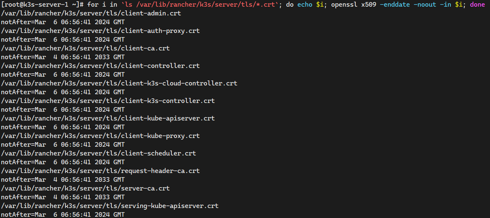
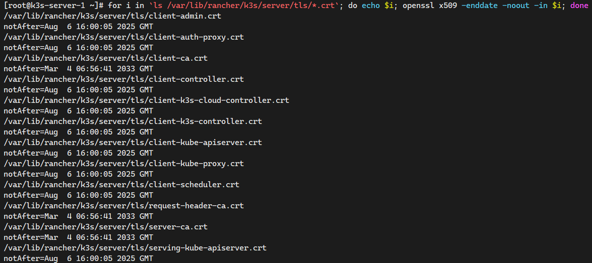

Video Reference：[17-高级选项和配置](https://www.bilibili.com/video/BV1cS4y177Lt/?spm_id_from=333.788&vd_source=9560c118fae1db9638f05a6ba2527085)

GitHub README.md：[17-高级选项和配置](https://github.com/kingsd041/k3s-tutorial/tree/main/17-高级选项和配置)

# 1 高级选项和配置

本节包含一些高级信息，描述了你可以运行和管理 K3s 的不同方式：

- [证书轮换](https://github.com/kingsd041/k3s-tutorial/tree/main/17-高级选项和配置#证书轮换)
- [自动部署清单](https://github.com/kingsd041/k3s-tutorial/tree/main/17-高级选项和配置#自动部署清单)
- [使用 Docker 作为容器运行时](https://github.com/kingsd041/k3s-tutorial/tree/main/17-高级选项和配置#使用-docker-作为容器运行时)
- [配置 containerd](https://github.com/kingsd041/k3s-tutorial/tree/main/17-高级选项和配置#配置-containerd)
- [节点标签和污点](https://github.com/kingsd041/k3s-tutorial/tree/main/17-高级选项和配置#节点标签和污点)
- [使用安装脚本启动 server 节点](https://github.com/kingsd041/k3s-tutorial/tree/main/17-高级选项和配置#使用安装脚本启动-server-节点)
- [Alpine Linux 安装的额外准备工作](https://github.com/kingsd041/k3s-tutorial/tree/main/17-高级选项和配置#alpine-linux-安装的额外准备工作)
- [运行 K3d（Docker 中的 K3s）和 docker-compose](https://github.com/kingsd041/k3s-tutorial/tree/main/17-高级选项和配置#运行-k3d（docker-中的-k3s）和-docker-compose)
- [在 Raspbian Buster 上启用旧版的 iptables](https://github.com/kingsd041/k3s-tutorial/tree/main/17-高级选项和配置#在-raspbian-buster-上启用旧版的-iptables)
- [为 Raspbian Buster 启用 cgroup](https://github.com/kingsd041/k3s-tutorial/tree/main/17-高级选项和配置#为-raspbian-buster-启用-cgroup)
- [SELinux 支持](https://github.com/kingsd041/k3s-tutorial/tree/main/17-高级选项和配置#selinux-支持)
- [Red Hat 和 CentOS 的额外准备](https://github.com/kingsd041/k3s-tutorial/tree/main/17-高级选项和配置#red-hat-和-centos-的额外准备)

Public Reference：[https://docs.rancher.cn/docs/k3s/advanced/_index#server-%E5%92%8C-agent-token](https://docs.rancher.cn/docs/k3s/advanced/_index#server-和-agent-token)

## 1.1 证书轮换

默认情况下，K3s 的证书在 12 个月内过期。

如果证书已经过期或剩余的时间不足 90 天，则在 K3s 重启时轮换证书。

```shell
# 查询K3s证书过期时间
for i in `ls /var/lib/rancher/k3s/server/tls/*.crt`; do echo $i; openssl x509 -enddate -noout -in $i; done

# 修改系统时间为证书过期前90天或证书过期后
$ timedatectl set-ntp no
$ date -s 20240807
$ kubectl get nodes
Unable to connect to the server: x509: certificate has expired or is not yet valid: current time 2026-08-07T00:00:04+08:00 is after 2025-08-06T16:00:35Z
$ tail -n 200 -f /var/log/messages
ojected volume kube-api-access-5kmph for pod kube-system/coredns-574bcc6c46-bdz6b: token "coredns"/"kube-system"/[]string(nil)/3607/v1.BoundObjectReference{Kind:"Pod", APIVersion:"v1", Name:"coredns-574bcc6c46-bdz6b", UID:"55b42ec9-8398-4b05-9ebd-dec42d4f5b88"} expired and refresh failed: Post "https://127.0.0.1:6443/api/v1/namespaces/kube-system/serviceaccounts/coredns/token": x509: certificate has expired or is not yet valid: current time 2026-08-07T00:00:35+08:00 is after 2025-08-06T16:00:35Z

# 重启K3s服务
service k3s restart
```



重启 K3s 服务之后就会证书更新



## 1.2 自动部署清单

在`/var/lib/rancher/k3s/server/manifests`中找到的任何文件都会以类似`kubectl apply & kubectl create`的方式自动部署到 Kubernetes。

关于部署 Helm charts 的信息，请参阅[Helm](https://github.com/kingsd041/k3s-tutorial/blob/main/helm/_index)章节。

```yaml
---
# nginx-deploy.yaml
apiVersion: apps/v1
kind: Deployment
metadata:
  name:  nginx-deploy
  namespace: default
  labels:
    app:  nginx-deploy
spec:
  selector:
    matchLabels:
      app: nginx-deploy
  replicas: 3
  template:
    metadata:
      labels:
        app:  nginx-deploy
    spec:
      containers:
      - name:  nginx-deploy
        image:  docker.io/nginx:1.23.3-alpine
        ports:
        - containerPort:  80
          name:  http
---
# nginx-svc.yaml
apiVersion: v1
kind: Service
metadata:
  name: nginx-svc
  namespace: default
spec:
  selector:
    app: nginx-svc
  type: NodePort
  ports:
  - name: nginx-http
    protocol: TCP
    port: 80
    targetPort: 80
    nodePort: 30080
$ cp nginx-deploy-svc.yaml /var/lib/rancher/k3s/server/manifests
$ ls -l /var/lib/rancher/k3s/server/manifests
total 28
-rw------- 1 root root 1108 Mar  7 17:41 ccm.yaml
-rw------- 1 root root 4381 Mar  7 17:41 coredns.yaml
-rw------- 1 root root 3645 Mar  7 17:41 local-storage.yaml
drwx------ 2 root root  227 Mar  7 17:41 metrics-server
-rw-r--r-- 1 root root  699 Mar  7 17:43 nginx-deploy-svc.yaml
-rw------- 1 root root 1039 Mar  7 17:41 rolebindings.yaml
-rw------- 1 root root 1098 Mar  7 17:41 traefik.yaml

# 自动部署nginx的资源
$ kubectl get all
NAME                               READY   STATUS    RESTARTS   AGE
pod/nginx-deploy-d4c47bf76-qdhpc   1/1     Running   0          2m43s
pod/nginx-deploy-d4c47bf76-rjvxw   1/1     Running   0          2m43s
pod/nginx-deploy-d4c47bf76-zq29b   1/1     Running   0          2m43s

NAME                 TYPE        CLUSTER-IP      EXTERNAL-IP   PORT(S)        AGE
service/kubernetes   ClusterIP   10.43.0.1       <none>        443/TCP        4m50s
service/nginx-svc    NodePort    10.43.165.157   <none>        80:30080/TCP   2m43s

NAME                           READY   UP-TO-DATE   AVAILABLE   AGE
deployment.apps/nginx-deploy   3/3     3            3           2m43s

NAME                                     DESIRED   CURRENT   READY   AGE
replicaset.apps/nginx-deploy-d4c47bf76   3         3         3       2m43s
```

## 1.3 使用 Docker 作为容器运行时

K3s 包含并默认为[containerd](https://containerd.io/)， 一个行业标准的容器运行时。

要使用 `Docker` 而不是 `containerd`。

1. 在 K3s 节点上安装 Docker。可以使用 Rancher 的一个[Docker 安装脚本](https://github.com/rancher/install-docker)来安装 Docker：

```shell
curl https://releases.rancher.com/install-docker/19.03.sh | sh
```

1. 使用`--docker`选项安装 K3s：

```shell
# 默认使用containerd的容器运行时环境
# 如果在containerd部署的集群，再使用该命令添加--docker参数，那么数据是无法进行同步的
# 即需要在Docker的运行时环境中再部署一套业务
curl -sfL https://get.k3s.io | sh -s - --docker
```

国内用户，可以使用以下方法加速安装：

```shell
curl -sfL https://rancher-mirror.rancher.cn/k3s/k3s-install.sh | INSTALL_K3S_MIRROR=cn sh -s - --docker

# 验证使用Docker的容器运行时环境
$ tail -n 4 /etc/systemd/system/k3s.service
ExecStart=/usr/local/bin/k3s \
    server \
        '--docker' \
```

1. 确认集群可用：

```shell
$ kubectl get pods --all-namespaces
NAMESPACE     NAME                                      READY   STATUS      RESTARTS   AGE
kube-system   local-path-provisioner-79f67d76f8-ttgfh   1/1     Running     0          52s
kube-system   coredns-597584b69b-qq5z8                  1/1     Running     0          52s
kube-system   svclb-traefik-a648aa7f-dfpqp              2/2     Running     0          48s
kube-system   helm-install-traefik-crd-67llw            0/1     Completed   0          53s
kube-system   helm-install-traefik-8prcj                0/1     Completed   1          53s
kube-system   traefik-66c46d954f-r7xkj                  1/1     Running     0          48s
kube-system   metrics-server-5f9f776df5-qtrtc           1/1     Running     0          52s
```

1. 确认 Docker 容器正在运行：

```shell
# 查看镜像的状态
$ sudo docker images
REPOSITORY                         TAG                    IMAGE ID       CREATED         SIZE
nginx                              1.23.3-alpine          2bc7edbc3cf2   3 weeks ago     40.7MB
calico/kube-controllers            v3.25.0                5e785d005ccc   7 weeks ago     71.6MB
calico/cni                         v3.25.0                d70a5947d57e   7 weeks ago     198MB
calico/node                        v3.25.0                08616d26b8e7   7 weeks ago     245MB
rancher/mirrored-metrics-server    v0.6.2                 25561daa6660   3 months ago    68.9MB
rancher/klipper-lb                 v0.4.0                 3449ea2a2bfa   3 months ago    8.76MB
rancher/klipper-helm               v0.7.4-build20221121   6f2af12f2834   3 months ago    251MB
rancher/mirrored-library-traefik   2.9.4                  288889429bec   4 months ago    135MB
rancher/local-path-provisioner     v0.0.23                9621e18c3388   4 months ago    37.4MB
rancher/mirrored-coredns-coredns   1.9.4                  a81c2ec4e946   5 months ago    49.8MB
rancher/mirrored-pause             3.6                    6270bb605e12   18 months ago   683kB

# 查看容器的状态
$ sudo docker ps
CONTAINER ID   IMAGE                        COMMAND                  CREATED              STATUS              PORTS     NAMES
72790bef3481   288889429bec                 "/entrypoint.sh --gl…"   About a minute ago   Up About a minute             k8s_traefik_traefik-66c46d954f-r7xkj_kube-system_b6d8d5a3-9101-47dc-92ee-8b8e7f7a89a9_0
5fde5015b5c2   rancher/mirrored-pause:3.6   "/pause"                 About a minute ago   Up About a minute             k8s_POD_traefik-66c46d954f-r7xkj_kube-system_b6d8d5a3-9101-47dc-92ee-8b8e7f7a89a9_0
591dd96d82dc   3449ea2a2bfa                 "entry"                  About a minute ago   Up About a minute             k8s_lb-tcp-443_svclb-traefik-a648aa7f-dfpqp_kube-system_ab119579-be89-469a-95de-809898cfec70_0
4c7e2f75316a   3449ea2a2bfa                 "entry"                  About a minute ago   Up About a minute             k8s_lb-tcp-80_svclb-traefik-a648aa7f-dfpqp_kube-system_ab119579-be89-469a-95de-809898cfec70_0
9be56dd5e3e9   rancher/mirrored-pause:3.6   "/pause"                 About a minute ago   Up About a minute             k8s_POD_svclb-traefik-a648aa7f-dfpqp_kube-system_ab119579-be89-469a-95de-809898cfec70_0
1537f4b91e88   25561daa6660                 "/metrics-server --c…"   About a minute ago   Up About a minute             k8s_metrics-server_metrics-server-5f9f776df5-qtrtc_kube-system_5605d10b-3c35-49e7-935c-db3bff7cba3b_0
eaad0b26823f   a81c2ec4e946                 "/coredns -conf /etc…"   About a minute ago   Up About a minute             k8s_coredns_coredns-597584b69b-qq5z8_kube-system_574ebd44-e071-487e-90f6-766ecf640288_0
e7653fc11bf7   9621e18c3388                 "local-path-provisio…"   About a minute ago   Up About a minute             k8s_local-path-provisioner_local-path-provisioner-79f67d76f8-ttgfh_kube-system_fe617e4d-a19b-4611-a4d8-5491ace1d400_0
1d6519574592   rancher/mirrored-pause:3.6   "/pause"                 About a minute ago   Up About a minute             k8s_POD_coredns-597584b69b-qq5z8_kube-system_574ebd44-e071-487e-90f6-766ecf640288_0
19384cabe50a   rancher/mirrored-pause:3.6   "/pause"                 About a minute ago   Up About a minute             k8s_POD_metrics-server-5f9f776df5-qtrtc_kube-system_5605d10b-3c35-49e7-935c-db3bff7cba3b_0
d3a7f8a9d819   rancher/mirrored-pause:3.6   "/pause"                 About a minute ago   Up About a minute             k8s_POD_local-path-provisioner-79f67d76f8-ttgfh_kube-system_fe617e4d-a19b-4611-a4d8-5491ace1d400_0
```

### 1.3.1 可选：将 crictl 与 Docker 一起使用

crictl 为兼容 CRI 的容器运行时提供了 CLI

如果你想在使用`--docker`选项安装 K3s 后使用 crictl，请参考[官方文档](https://github.com/kubernetes-sigs/cri-tools/blob/master/docs/crictl.md)来安装 crictl。

```shell
# 但是使用较少，原因是Docker的CLI工具比Containerd的CLI工具要丰富的多
$ VERSION="v1.26.0"
$ curl -L https://github.com/kubernetes-sigs/cri-tools/releases/download/$VERSION/crictl-${VERSION}-linux-amd64.tar.gz --output crictl-${VERSION}-linux-amd64.tar.gz
$ sudo tar zxvf crictl-$VERSION-linux-amd64.tar.gz -C /usr/local/bin
crictl
```

然后开始使用 crictl 命令：

```shell
$ sudo crictl version
Version:  0.1.0
RuntimeName:  docker
RuntimeVersion:  19.03.9
RuntimeApiVersion:  1.40.0

$ sudo crictl images
IMAGE                                        TAG                    IMAGE ID            SIZE
docker.io/library/nginx                      1.23.3-alpine          2bc7edbc3cf2f       16.7MB
docker.io/rancher/klipper-helm               v0.6.6-build20211022   194c895f8d63f       84.5MB
docker.io/rancher/klipper-lb                 v0.3.4                 746788bcc27e2       3.33MB
docker.io/rancher/local-path-provisioner     v0.0.21                fb9b574e03c34       11.4MB
docker.io/rancher/mirrored-coredns-coredns   1.9.1                  99376d8f35e0a       14.1MB
docker.io/rancher/mirrored-library-traefik   2.6.1                  cf9fa2c5f0d2e       30.3MB
docker.io/rancher/mirrored-metrics-server    v0.5.2                 f73640fb50619       26MB
```

### 1.3.2 以下操作将删除节点中的数据（包括容器，卷，iptables 等），在执行命令之前，请先查看该脚本，确保您理解这个脚本在做什么，并且确保已进行了数据备份。

Reference：[https://docs.rancher.cn/docs/rancher2/trending-topics/cleaning-cluster-nodes/_index/#%E6%B8%85%E7%90%86%E8%84%9A%E6%9C%AC](https://docs.rancher.cn/docs/rancher2/trending-topics/cleaning-cluster-nodes/_index/#清理脚本)

```shell
#!/bin/bash

KUBE_SVC='
kubelet
kube-scheduler
kube-proxy
kube-controller-manager
kube-apiserver
'

for kube_svc in ${KUBE_SVC};
do
  # 停止服务
  if [[ `systemctl is-active ${kube_svc}` == 'active' ]]; then
    systemctl stop ${kube_svc}
  fi
  # 禁止服务开机启动
  if [[ `systemctl is-enabled ${kube_svc}` == 'enabled' ]]; then
    systemctl disable ${kube_svc}
  fi
done

# 停止所有容器
docker stop $(docker ps -aq)

# 删除所有容器
docker rm -f $(docker ps -qa)

# 删除所有容器卷
docker volume rm $(docker volume ls -q)

# 卸载mount目录
for mount in $(mount | grep tmpfs | grep '/var/lib/kubelet' | awk '{ print $3 }') /var/lib/kubelet /var/lib/rancher;
do
  umount $mount;
done

# 备份目录
mv /etc/kubernetes /etc/kubernetes-bak-$(date +"%Y%m%d%H%M")
mv /var/lib/etcd /var/lib/etcd-bak-$(date +"%Y%m%d%H%M")
mv /var/lib/rancher /var/lib/rancher-bak-$(date +"%Y%m%d%H%M")
mv /opt/rke /opt/rke-bak-$(date +"%Y%m%d%H%M")

# 删除残留路径
rm -rf /etc/ceph \
    /etc/cni \
    /opt/cni \
    /run/secrets/kubernetes.io \
    /run/calico \
    /run/flannel \
    /var/lib/calico \
    /var/lib/cni \
    /var/lib/kubelet \
    /var/log/containers \
    /var/log/kube-audit \
    /var/log/pods \
    /var/run/calico \
    /usr/libexec/kubernetes

# 清理网络接口
no_del_net_inter='
lo
docker0
eth
ens
bond
'

network_interface=`ls /sys/class/net`

for net_inter in $network_interface;
do
  if ! echo "${no_del_net_inter}" | grep -qE ${net_inter:0:3}; then
    ip link delete $net_inter
  fi
done

# 清理残留进程
port_list='
80
443
6443
2376
2379
2380
8472
9099
10250
10254
'

for port in $port_list;
do
  pid=`netstat -atlnup | grep $port | awk '{print $7}' | awk -F '/' '{print $1}' | grep -v - | sort -rnk2 | uniq`
  if [[ -n $pid ]]; then
    kill -9 $pid
  fi
done

kube_pid=`ps -ef | grep -v grep | grep kube | awk '{print $2}'`

if [[ -n $kube_pid ]]; then
  kill -9 $kube_pid
fi

# 清理Iptables表
## 注意：如果节点Iptables有特殊配置，以下命令请谨慎操作
sudo iptables --flush
sudo iptables --flush --table nat
sudo iptables --flush --table filter
sudo iptables --table nat --delete-chain
sudo iptables --table filter --delete-chain
systemctl restart docker
```

当K3s使用Docker作为容器运行时环境时，使用K3s自带的卸载K3s脚本是清理不干净环境的，需要借用官网的清理节点的脚本进行彻底删除

当K3s使用Containerd作为容器运行时环境时，使用K3s自带的卸载K3s脚本是可以正常清理环境的

## 1.4 配置 containerd

Containerd 对配置镜像以及其他设置时，使用Containerd的语法是很难配置的，并且很难配置成功。

Reference：https://docs.rancher.cn/docs/k3s/installation/private-registry/_index

K3s 将会在`/var/lib/rancher/k3s/agent/etc/containerd/config.toml`中为 `containerd` 生成 `config.toml`。

```shell
$ cat /var/lib/rancher/k3s/agent/etc/containerd/config.toml

version = 2

[plugins."io.containerd.internal.v1.opt"]
  path = "/var/lib/rancher/k3s/agent/containerd"
[plugins."io.containerd.grpc.v1.cri"]
  stream_server_address = "127.0.0.1"
  stream_server_port = "10010"
  enable_selinux = false
  enable_unprivileged_ports = false
  enable_unprivileged_icmp = false
  sandbox_image = "rancher/mirrored-pause:3.6"

[plugins."io.containerd.grpc.v1.cri".containerd]
  snapshotter = "overlayfs"
  disable_snapshot_annotations = true


[plugins."io.containerd.grpc.v1.cri".cni]
  bin_dir = "/var/lib/rancher/k3s/data/630c40ff866a3db218a952ebd4fd2a5cfe1543a1a467e738cb46a2ad4012d6f1/bin"
  conf_dir = "/var/lib/rancher/k3s/agent/etc/cni/net.d"


[plugins."io.containerd.grpc.v1.cri".containerd.runtimes.runc]
  runtime_type = "io.containerd.runc.v2"

[plugins."io.containerd.grpc.v1.cri".containerd.runtimes.runc.options]
  SystemdCgroup = false
```

如果要对这个文件进行高级定制，你可以在同一目录中创建另一个名为 `config.toml.tmpl` 的文件，此文件将会代替默认设置。

`config.toml.tmpl`将被视为 Go 模板文件，并且`config.Node`结构被传递给模板。[此模板](https://github.com/rancher/k3s/blob/master/pkg/agent/templates/templates.go#L16-L32)示例介绍了如何使用结构来自定义配置文件。

```shell
version = 2

[plugins."io.containerd.internal.v1.opt"]
  path = "/var/lib/rancher/k3s/agent/containerd"
[plugins."io.containerd.grpc.v1.cri"]
  stream_server_address = "127.0.0.1"
  stream_server_port = "10010"
  enable_selinux = false
  enable_unprivileged_ports = false
  enable_unprivileged_icmp = false
  sandbox_image = "rancher/mirrored-pause:3.6"

[plugins."io.containerd.grpc.v1.cri".containerd]
  snapshotter = "overlayfs"
  disable_snapshot_annotations = true


[plugins."io.containerd.grpc.v1.cri".cni]
  bin_dir = "/var/lib/rancher/k3s/data/630c40ff866a3db218a952ebd4fd2a5cfe1543a1a467e738cb46a2ad4012d6f1/bin"
  conf_dir = "/var/lib/rancher/k3s/agent/etc/cni/net.d"


[plugins."io.containerd.grpc.v1.cri".containerd.runtimes.runc]
  runtime_type = "io.containerd.runc.v2"

[plugins."io.containerd.grpc.v1.cri".containerd.runtimes.runc.options]
  SystemdCgroup = false

[plugins.cri.registry.mirrors]
  [plugins.cri.registry.mirrors."docker.io"]
    endpoint = ["https://po13h3y1.mirror.aliyuncs.com", "https://registry-1.docker.io"]
$ curl -sfL https://rancher-mirror.rancher.cn/k3s/k3s-install.sh | INSTALL_K3S_MIRROR=cn \
  INSTALL_K3S_VERSION="v1.21.14+k3s1" sh -

# 修改配置文件后重启服务
$ systemctl restart k3s.service
$ crictl info | grep -A 4 registry
    "registry": {
      "mirrors": {
        "docker.io": {
          "endpoint": [
            "https://po13h3y1.mirror.aliyuncs.com",
            "https://registry-1.docker.io"
          ],
          "rewrite": null
        }
      },
```

## 1.5 节点标签和污点

K3s agents 可以通过`--node-label`和`--node-taint`选项进行配置，这两个选项可以给 kubelet 添加标签和污点。这两个选项只能[在注册时](https://docs.rancher.cn/docs/k3s/installation/install-options/_index#k3s-agent的注册选项)添加标签和/或污点，所以它们只能被添加一次，之后不能再通过运行 K3s 命令来改变。

如果你想在节点注册后更改节点标签和污点，你应该使用`kubectl`。关于如何添加[污点](https://kubernetes.io/docs/concepts/configuration/taint-and-toleration/)和[节点标签](https://kubernetes.io/docs/tasks/configure-pod-container/assign-pods-nodes/#add-a-label-to-a-node)，请参考 Kubernetes 官方文档。

```bash
# 添加label和taint
# --node-label 是可以通过以下命令进行更新的<标签>
# --node-taint 是不可以通过以下命令进行更新的<污点> 需要通过 kubectl 进行修改
curl -sfL https://get.k3s.io | sh -s - --node-label app=k3s --node-taint special=true:NoSchedule

# 查询label和taint
kubectl get nodes --show-labels
kubectl describe nodes | grep Taints
```

## 1.6 使用安装脚本启动 Server 节点

Reference：https://docs.rancher.cn/docs/k3s/installation/install-options/server-config/_index

安装脚本将自动检测您的操作系统是使用 `systemd` 还是 `openrc` 并启动服务。当使用 `openrc` 运行时，日志将在`/var/log/k3s.log`中创建。

当使用 systemd 运行时，日志将在`/var/log/syslog`中创建，并使用`journalctl -u k3s`查看。

使用安装脚本进行安装和自动启动的示例：

```shell
curl -sfL https://get.k3s.io | sh -
```

国内用户，可以使用以下方法加速安装：

```shell
curl -sfL http://rancher-mirror.cnrancher.com/k3s/k3s-install.sh | INSTALL_K3S_MIRROR=cn sh - 
```

当手动运行 server 时，你应该得到一个类似于下面的输出：

```shell
$ k3s server
INFO[2019-01-22T15:16:19.908493986-07:00] Starting k3s dev
INFO[2019-01-22T15:16:19.908934479-07:00] Running kube-apiserver --allow-privileged=true --authorization-mode Node,RBAC --service-account-signing-key-file /var/lib/rancher/k3s/server/tls/service.key --service-cluster-ip-range 10.43.0.0/16 --advertise-port 6445 --advertise-address 127.0.0.1 --insecure-port 0 --secure-port 6444 --bind-address 127.0.0.1 --tls-cert-file /var/lib/rancher/k3s/server/tls/localhost.crt --tls-private-key-file /var/lib/rancher/k3s/server/tls/localhost.key --service-account-key-file /var/lib/rancher/k3s/server/tls/service.key --service-account-issuer k3s --api-audiences unknown --basic-auth-file /var/lib/rancher/k3s/server/cred/passwd --kubelet-client-certificate /var/lib/rancher/k3s/server/tls/token-node.crt --kubelet-client-key /var/lib/rancher/k3s/server/tls/token-node.key
Flag --insecure-port has been deprecated, This flag will be removed in a future version.
INFO[2019-01-22T15:16:20.196766005-07:00] Running kube-scheduler --kubeconfig /var/lib/rancher/k3s/server/cred/kubeconfig-system.yaml --port 0 --secure-port 0 --leader-elect=false
INFO[2019-01-22T15:16:20.196880841-07:00] Running kube-controller-manager --kubeconfig /var/lib/rancher/k3s/server/cred/kubeconfig-system.yaml --service-account-private-key-file /var/lib/rancher/k3s/server/tls/service.key --allocate-node-cidrs --cluster-cidr 10.42.0.0/16 --root-ca-file /var/lib/rancher/k3s/server/tls/token-ca.crt --port 0 --secure-port 0 --leader-elect=false
Flag --port has been deprecated, see --secure-port instead.
INFO[2019-01-22T15:16:20.273441984-07:00] Listening on :6443
INFO[2019-01-22T15:16:20.278383446-07:00] Writing manifest: /var/lib/rancher/k3s/server/manifests/coredns.yaml
INFO[2019-01-22T15:16:20.474454524-07:00] Node token is available at /var/lib/rancher/k3s/server/node-token
INFO[2019-01-22T15:16:20.474471391-07:00] To join node to cluster: k3s agent -s https://10.20.0.3:6443 -t ${NODE_TOKEN}
INFO[2019-01-22T15:16:20.541027133-07:00] Wrote kubeconfig /etc/rancher/k3s/k3s.yaml
INFO[2019-01-22T15:16:20.541049100-07:00] Run: k3s kubectl
```

由于 agent 将创建大量的日志，输出可能会更长。默认情况下，server 会将自身注册为一个节点（运行 agent）。

## 1.7 Alpine Linux 安装的额外准备工作

设置 Alpine Linux 前，您需要进行以下准备工作：

1. 更新 `**/etc/update-extlinux.conf**` 添加：

```shell
# 启用cgroup的内核
default_kernel_opts="...  cgroup_enable=cpuset cgroup_memory=1 cgroup_enable=memory"
```

1. 更新配置并重启：

```shell
update-extlinux 
reboot
```

## 1.8 运行 K3d（Docker 中的 K3s）和 docker-compose

[k3d](https://github.com/rancher/k3d) 是一个设计用于在 Docker 中轻松运行 K3s 的工具。

它可以通过 MacOS 上的[brew](https://brew.sh/)工具安装：

```shell
# 需要有Docker容器运行时环境
brew install k3d

# Linux
# https://github.com/k3d-io/k3d/releases/download/v5.4.8/k3d-linux-amd64
$ wget https://github.com/k3d-io/k3d/releases/download/v5.4.8/k3d-linux-amd64
$ mv k3d-linux-amd64 /usr/local/bin/k3d
$ chmod +x /usr/local/bin/k3d

# 查看K3d版本
$ k3d version
k3d version v5.4.8
k3s version v1.25.6-k3s1 (default)

# 创建集群环境
$ k3d cluster create demo --servers 1 --agents 2
# 若出现相关的报错，可以使用以下的解决方案
# 原因是因为防火墙关闭之后需要重启docker服务。systemctl restart docker 

INFO[0000] Prep: Network
INFO[0000] Created network 'k3d-demo'
INFO[0000] Created image volume k3d-demo-images
INFO[0000] Starting new tools node...
INFO[0001] Creating node 'k3d-demo-server-0'
INFO[0005] Creating node 'k3d-demo-agent-0'
INFO[0005] Creating node 'k3d-demo-agent-1'
INFO[0005] Creating LoadBalancer 'k3d-demo-serverlb'
INFO[0005] Using the k3d-tools node to gather environment information
INFO[0007] Pulling image 'ghcr.io/k3d-io/k3d-tools:5.4.8'
INFO[0011] Starting Node 'k3d-demo-tools'
INFO[0011] HostIP: using network gateway 172.18.0.1 address
INFO[0011] Starting cluster 'demo'
INFO[0011] Starting servers...
INFO[0011] Starting Node 'k3d-demo-server-0'
INFO[0016] Starting agents...
INFO[0016] Starting Node 'k3d-demo-agent-0'
INFO[0016] Starting Node 'k3d-demo-agent-1'
INFO[0020] Starting helpers...
INFO[0021] Starting Node 'k3d-demo-serverlb'
INFO[0027] Injecting records for hostAliases (incl. host.k3d.internal) and for 4 network members into CoreDNS configmap...
INFO[0029] Cluster 'demo' created successfully!
INFO[0029] You can now use it like this:
kubectl cluster-info

# 查看Docker Version版本
$ docker version
Client: Docker Engine - Community
 Version:           23.0.1
 API version:       1.41 (downgraded from 1.42)
 Go version:        go1.19.5
 Git commit:        a5ee5b1
 Built:             Thu Feb  9 19:51:00 2023
 OS/Arch:           linux/amd64
 Context:           default

Server: Docker Engine - Community
 Engine:
  Version:          20.10.9
  API version:      1.41 (minimum version 1.12)
  Go version:       go1.16.8
  Git commit:       79ea9d3
  Built:            Mon Oct  4 16:06:37 2021
  OS/Arch:          linux/amd64
  Experimental:     false
 containerd:
  Version:          1.6.18
  GitCommit:        2456e983eb9e37e47538f59ea18f2043c9a73640
 runc:
  Version:          1.1.4
  GitCommit:        v1.1.4-0-g5fd4c4d
 docker-init:
  Version:          0.19.0
  GitCommit:        de40ad0

# 查看Docker容器
$ docker ps
CONTAINER ID   IMAGE                            COMMAND                  CREATED              STATUS          PORTS                             NAMES
bf83b5a70ce7   ghcr.io/k3d-io/k3d-proxy:5.4.8   "/bin/sh -c nginx-pr…"   About a minute ago   Up 49 seconds   80/tcp, 0.0.0.0:42479->6443/tcp   k3d-demo-serverlb
7757176c59f9   rancher/k3s:v1.25.6-k3s1         "/bin/k3s agent"         About a minute ago   Up 52 seconds                                     k3d-demo-agent-1
90e99a19ef02   rancher/k3s:v1.25.6-k3s1         "/bin/k3s agent"         About a minute ago   Up 53 seconds                                     k3d-demo-agent-0
ab7f743a0848   rancher/k3s:v1.25.6-k3s1         "/bin/k3s server --t…"   About a minute ago   Up 58 seconds                                     k3d-demo-server-0
```

`rancher/k3s`镜像也可用于在 Docker 运行的 K3s server 和 agent。

在 K3s repo 的根目录下有一个`docker-compose.yml`，作为如何从 Docker 运行 K3s 的示例。要从这个 repo 中运行`docker-compose`，请运行：

```shell
$ docker-compose up --scale agent=3
    # kubeconfig is written to current dir

$ kubectl --kubeconfig kubeconfig.yaml get node
NAME           STATUS   ROLES    AGE   VERSION
497278a2d6a2   Ready    <none>   11s   v1.13.2-k3s2
d54c8b17c055   Ready    <none>   11s   v1.13.2-k3s2
db7a5a5a5bdd   Ready    <none>   12s   v1.13.2-k3s2
```

要只在 Docker 中运行 agent，使用`docker-compose up agent`。

或者，也可以使用`docker run`命令：

```shell
sudo docker run \
  -d --tmpfs /run \
  --tmpfs /var/run \
  -e K3S_URL=${SERVER_URL} \
  -e K3S_TOKEN=${NODE_TOKEN} \
  --privileged rancher/k3s:vX.Y.Z
```

## 1.9 在 Raspbian Buster 上启用旧版的 iptables

Raspbian Buster 默认使用`nftables`而不是`iptables`。 **K3S** 网络功能需要使用iptables，而不能使用`nftables`。 按照以下步骤切换配置**Buster**使用`legacy iptables`：

```shell
sudo iptables -F
sudo update-alternatives --set iptables /usr/sbin/iptables-legacy
sudo update-alternatives --set ip6tables /usr/sbin/ip6tables-legacy
sudo reboot
```

## 1.10 为 Raspbian Buster 启用 cgroup

标准的 Raspbian Buster 安装没有启用 `cgroups`。**K3S** 需要`cgroups`来启动 systemd 服务。在`/boot/cmdline.txt`中添加`cgroup_memory=1 cgroup_enable=memory`就可以启用`cgroups`。

### /boot/cmdline.txt 的示例

```shell
console=serial0,115200 console=tty1 root=PARTUUID=58b06195-02 rootfstype=ext4 elevator=deadline fsck.repair=yes rootwait cgroup_memory=1 cgroup_enable=memory
```

## 1.11 SELinux 支持

从 v1.19.4+k3s1 开始支持。从 v1.17.4+k3s1 开始是试验性的。

如果您在默认启用 SELinux 的系统（如 CentOS）上安装 K3s，您必须确保安装了正确的 SELinux 策略。

### 1.11.1 自动安装

从 v1.19.3+k3s2 开始可用。

如果在兼容的系统上，如果不执行离线安装，则[安装脚本](https://docs.rancher.cn/docs/k3s/installation/install-options/_index#使用脚本安装的选项)将从 Rancher RPM 存储库自动安装 SELinux RPM。可以通过设置 `INSTALL_K3S_SKIP_SELINUX_RPM=true` 来跳过自动安装。

### 1.11.2 手动安装

可以使用以下命令安装必要的策略：

```shell
yum install -y container-selinux selinux-policy-base 
yum install -y https://rpm.rancher.io/k3s/latest/common/centos/7/noarch/k3s-selinux-0.2-1.el7_8.noarch.rpm 
```

要强制安装脚本记录警告而不是失败，您可以设置以下环境变量： `INSTALL_K3S_SELINUX_WARN=true`。

## 1.12 Red Hat 和 CentOS 的额外准备

建议运行以下命令，关闭 `firewalld`：

```shell
# 在生产环境和测试环境中可以执行firewalld功能
systemctl disable firewalld --now
```